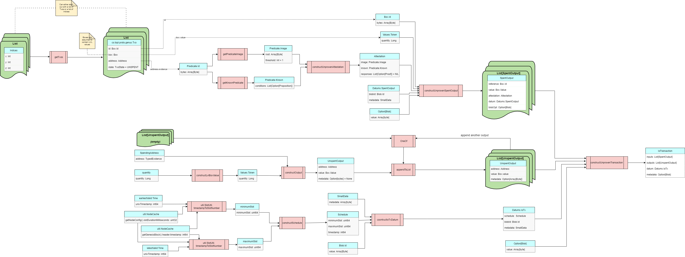

# Native Transaction Builder

This page describes the Brambl SDK's transaction builder. This is the portion of the SDK that is responsible for
building Topl unproven transactions.

This page is organized into two parts.

* [The first part](#transaction-builder-data-flow) describes the data flow that the transaction builder supports for
  building unproven transactions.
* [The second part](#structure-of-the-transaction-builder) describes the structure of the transaction builder in detail.

## Transaction Builder Data Flow

The following diagram shows the typical data flow that will be used to build transactions using the
transaction builder. The flow of the diagram is from left to right.



In the following discussion, we describe the inputs to unproven transaction constructor that produces
an `UnprovenTransaction`.

### Creating a Schedule

A transaction's schedule determines the earliest and latest slot number that a transaction may be incorporated into a
block. Slot numbers are not meaningful outside the blockchain network. Users and applications that care about when
transactions are incorporated into a block will generally want to express those times as timestamps. For this reason,
the first step in creating a schedule is to pick values for the earliest and latest times that the transaction is valid.

#### Selecting earliest and latest times a transaction may be included in a block

The earliest and latest valid times can be represented as [Unix timestamps](https://www.unixtimestamp.com/). Both values
must be provided. For the many cases where we want a transaction to be as soon as possible, a good value for the
earliest valid time is the current time. Our API provides the current time as a default for earliest valid time.
Choosing a value for the latest valid time is a more complicated.

If the transaction author does not care about the latest time that a transaction is valid for inclusion in a block, then
a reasonable default would be 2<sup>63</sup>-1 (9,223,372,036,854,775,807), which is the largest value that can be
represented as a Unix timestamp. However, this is not recommended.

Topl recommends that transaction authors _do_ care about the latest valid time. The reason for this is that there is no
way to determine that a request to add a transaction to the blockchain is successful until the transaction appears on
the blockchain. If the end of time is provided as the value of the transaction's latest valid time to be added, then
clients will have to wait until the end of time before deciding that a request add a transaction to failed.

[//]: # (TODO: update with more guidance on a default value for lastest valid time)
For now, the recommendation is to set the latest valid time to 8 minutes after the current time. In the future there may
be a better way to determine a default value for latest valid time.

#### Converting Unix timestamps to slot numbers

Once we have Unix timestamps specifying the earliest and latest times that the transaction will be valid for including
in a block, the next step is to convert those times into slot numbers. Slot numbers are the way that time is tracked by
Bifrost nodes.

To convert timestamps to slot numbers we use the
method/function [timestampToSlotNumber](Util/NodeUtils#timestamptoslotnumber). 

### Creating the Outputs

### Creating the Inputs

### Application-Provided Data

## Structure of the Transaction Builder

Below, we describe the classes and interfaces that the Bramble SDK provides for building transactions. The
descriptions are in a language-neutral form. To be language-neutral,
we [follow a set of assumptions](../../Overview/Assumptions)

Here are the interfaces and classes that are described on this page:

* [Schedule](#class-schedule)
* [Signable](#interface-signable)
* [UnprovenTransaction](#class-unproventransaction)

## Interfaces
These interfaces must be implemented by some of the classes that are used to build an `UnprovenTransaction`

### Interface Signable

[//]: # (TODO: Sean please add missing details)
This interface is responsible for caching various information from a BiFrost node.

This interface contains just one method/function.

### signableBytes

#### Signature(s)

```
signableBytes() returns Array[byte]
```

#### Description

Gets a byte array representation of this object that should be used as sequence of bytes to use for hashes and
signatures based on this object.

#### Parameters

_No Parameters_

#### Returns

The array of bytes.

#### Implementation Note

Implementations of this for composite objects may call the `signableBytes` method of their constituent objects. For
example, The implementation of the method for transactions will call the `signableBytes` methods of a transaction's
inputs and outputs.

Implementing this method to return an array of bytes may result in more effort spent copying that necessary. For this
reason, you may consider implementing this to return a smarter return type that will avoid most of the unnecessary
copying.

#### Errors

The errors that the method/function will produce include:

_None_

#### Testing Procedure

The exact tests used for this method will vary with the implementation, but should include a test to verify that if two
objects implement `Signable` and compare as equal, then the `signableBytes` methods of both objects returns identical
results.

## Classes
These classes are used to build an `UnprovenTransaction`

### Class Schedule 
**Implements** `Signable`

### Constructor

#### Signature(s)

```
Schedule(minValidSlot: uint64, maxValidSlot: uint64, timestamp: int64)
```

#### Description

Construct a `Schedule` object.

#### Parameters

_No Parameters_

#### Returns

The cached `co.topl.proto.models.FullBlock` object.

#### Errors

The errors that the method/function will produce as a result of a failed asynchronous query initiated by the constructor
include:

* minValidSlot > maxValidSlot

#### Testing Procedure

The testing procedure for the constructor
is [described on a separate page](NodeUtils/nodecache_tests/getgenesisblock_test)

=============================

### Class UnprovenTransaction
**Implements** `Signable`


