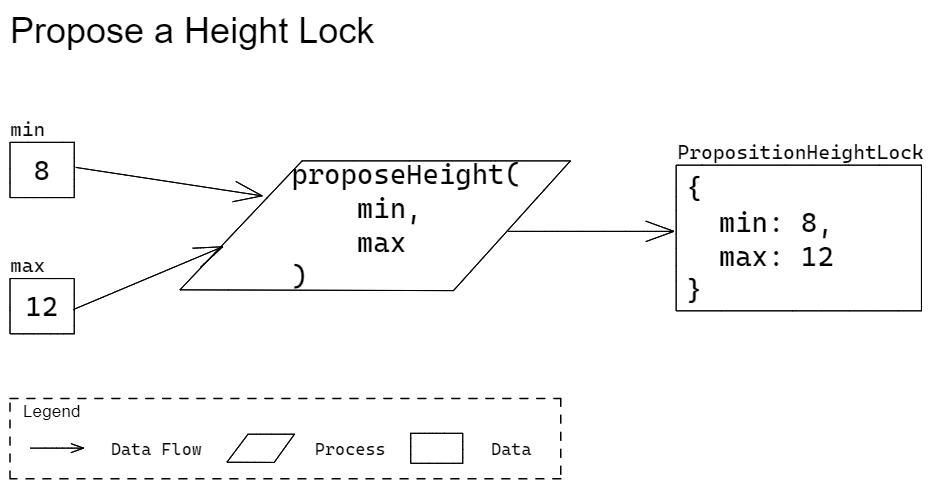

# Proposer

This document describes the functions that the Quivr library within the SDK provides for creating Propositions. 

Various data types are used to describe the parameters and return types of the functions. These types are either the data types provided by [Protobuf](https://developers.google.com/protocol-buffers/docs/proto3) or will be defined in a separate [protobuf specifications repo](https://github.com/Topl/protobuf-specs/) from which language specific denitions will be generated. To denote a specific type given by Protobuf's `oneof`, the data types in this specification will make use of the following syntax: `ParentType[ChildType]`. For example, `Parent[Child1]` denotes the type `Parent` whose oneof-value is of type `Child1` given the following Protobuf definition:

```
message Parent {
  oneof sealed_value {
    Child1 c1 = 1;
    Child2 c2 = 2;
    ...
  }
}
```

## Propose Height Range

### Signature

```
proposeHeight(chain: string, min: uint64, max: uint64) => Proposition[PropositionContextualHeightLock]
```

* Parameters
  * `chain`  
  A label denoting the chain for which the height requirements will be tested against. This value must refer to a valid label in the evaluation context during verification. 
    * Type: string
    * Required: true
  * `min`  
  The minimum allowable block height, inclusive. This value must satisfy the following range: 1 <= `min` <= 2<sup>63</sup>-1. Must be less than or equal to `max`.
    * Type: `uint64`
    * Required: true
  * `max`  
  The maximum allowable block height, inclusive. This value must satisfy the following range: 1 <= `min` <= 2<sup>63</sup>-1. Must be greater than or equal to `min`.
    * Type: `uint64`
    * Required: true
* Return  
The created Height Lock Proposition. A Height Lock Proposition specifies the minimum height that a blockchain must be, the maximum height that a blockchain must be, and a label denoting the chain for which these minimum and maximum values must be verified against. 
  * Type: `Proposition[PropositionContextualHeightLock]`

### Errors

The errors that the method/function will produce include:

* `min` or `max` parameters are not provided.
* `min` or `max` is out of range. Acceptable values are 1 to 9223372036854775807 inclusive.
* `max`is not greater or equal to `min`

### Description

Create a Height Lock Proposition. A Height Lock Proposition requires that its containing transaction joins a block whose height is valid. The height of the block will be specified by the parameter `chain`. A given block height is valid if both of the following conditions are true:

* height is less than or equal to `max`
* height is greater than or equal to `min`

If any of the provided parameters are invalid, then an error will occur. The error will be presented in a way that adheres to the best practices of the implementing language.

> TODO: Update diagram



### Tests

The testing procedure and vectors are provided in a [separate page](ProposerTests.md#propose-height-range-tests).