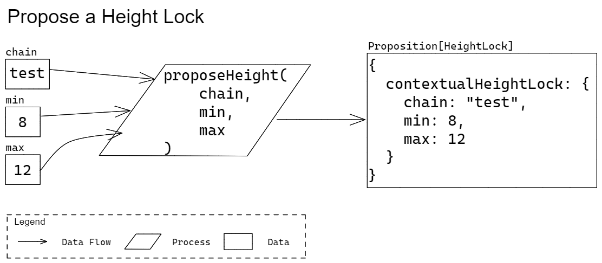

# Proposer 

Functions related to creating Propositions.

## Propose Height Lock

### Signature

` proposeHeight(min: uint64, max: uint64) => PropositionHeightLock `

* Parameters
  * `min`  
  The minimum allowable block height.
    * Type: `uint64`
    * Required: true
  * `max`  
  The maximum allowable block height.
    * Type: `uint64`
    * Required: true
* Return  
The created Height Lock Proposition.
  * Type: `PropositionHeightLock`

### Description

Create a Height Lock Proposition. A Height Lock Proposition requires that its containing transaction joins a block whose height is valid (per `min` and `max` parameters).



### Test Vectors

The test vectors represent the inputs and outputs of the following language-agnostic pseudo code:

` proposition = Quivr.Proposer.proposeHeight(min, max) `

```json
[
  {
    "inputs": {
      "min": 8,
      "max": 12
    },
    "outputs": {
      "proposition": {
        "min": 8,
        "max": 12
      }
    }
  }
]
```

