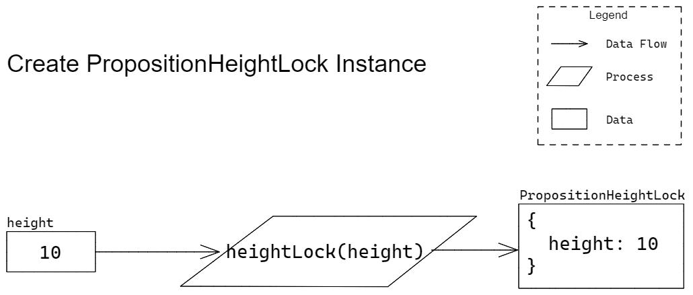
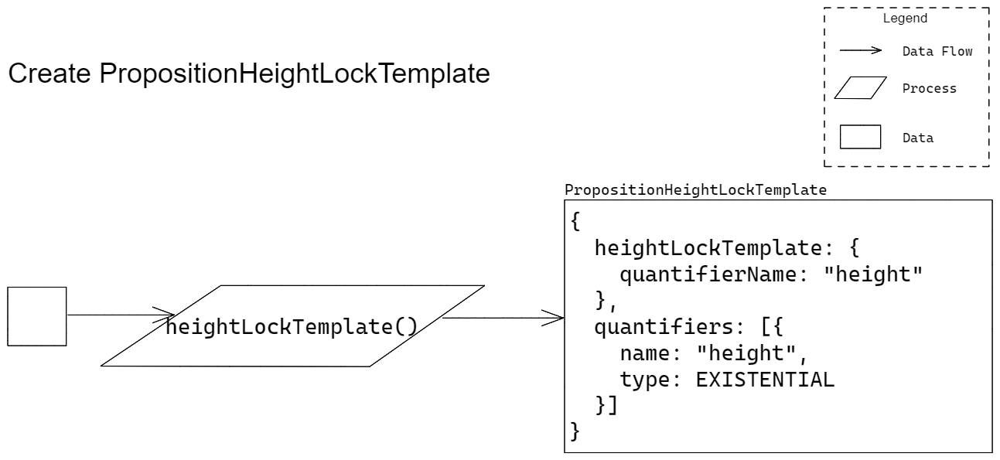

# Height Lock

Proposer Functions Specific to Height Lock

## Create a Height Lock Proposition

### Signature

` heightLock(height) => PropositionHeightLock `

> TODO: Explain parameters and return type

### Example Usage

` heightLock(10) `

> TODO: make more comprehensive

### Description

Directly create an instance of a Height Lock Proposition.

> TODO: add more

### Test Vectors

> TODO: embed test vectors

## Create a Height Lock Proposition Template

### Signature

` heightLockTemplate() => PropositionHeightLockTemplate `

> TODO: Explain parameters and return type

### Example Usage

` heightLockTemplate() `

> TODO: make more comprehensive

### Description

Create a template that can be used to create a Height Lock Proposition.

> TODO: add more

### Test Vectors

> TODO: embed test vectors