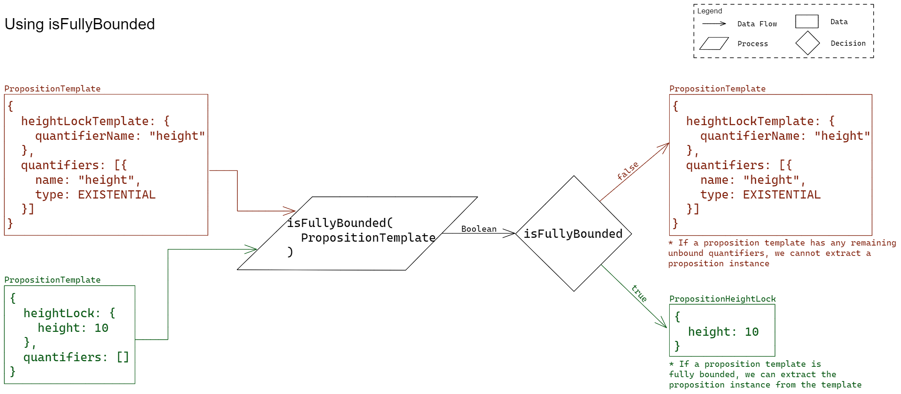

# Templates

Proposer Functions Generic to All Templates

## Bind a Proposition Template

### Signature

` bindPropositionTemplate(PropositionTemplate, quantifierValues) => PropositionTemplate `

> TODO: Explain parameters and return type

### Example Usage

` bindPropositionTemplate(propTemplate, quantifierValues)`

> TODO: make more comprehensive

### Description

Binds quantifier values to unbound quantifiers referenced in the given template.

> TODO: add more

### Test Vectors

> TODO: embed test vectors

## Check if a Proposition Template is Fully Bound

### Signature

` isFullyBounded(PropositionTemplate) => Boolean ` 

> TODO: Explain parameters and return type

### Example Usage

` isFullyBounded(propTemplate)`

> TODO: make more comprehensive

### Description

Returns whether the given proposition template is fully bound. Fully bound means no unbound quantifiers remain. 

### Test Vectors

> TODO: embed test vectors