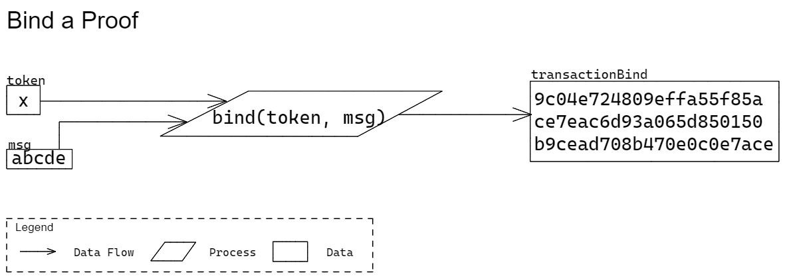
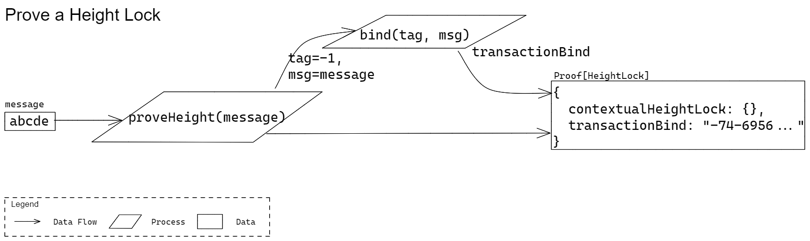

# Prover

This document describes the functions that the Quivr library within the SDK provides for creating Proofs. 

Various data types are used to describe the parameters and return types of the functions. These types are either the data types provided by [Protobuf](https://developers.google.com/protocol-buffers/docs/proto3) or will be defined in a separate [protobuf specifications repo](https://github.com/Topl/protobuf-specs/) from which language specific denitions will be generated. To denote a specific type given by Protobuf's `oneof`, the data types in this specification will make use of the following syntax: `ParentType[ChildType]`. For example, `Parent[Child1]` denotes the type `Parent` whose oneof-value is of type `Child1` given the following Protobuf definition:

```
message Parent {
  oneof sealed_value {
    Child1 c1 = 1;
    Child2 c2 = 2;
    ...
  }
}
```

## Bind Proof

### Signature

```
bind(tag: bytes, message: bytes) => bytes 
```

* Parameters
  * `tag`  
  An identifier of the Quivr operation. Each type of Quivr operation has its own unique tag that are pre-defined (see description below).
    * Type: `bytes`  
    This parameter should only contain a single byte. This specification denotes this type as `bytes` since Protobuf does not have a type for a single byte.
    * Required: true
  * `message`  
  Unique bytes from a transaction that will be bound to a proof. It represents the signable bytes of the transaction for which the proof will become apart of.
    * Type: `bytes`
    * Required: true
* Return  
A transaction binding for a proof. Similar to a "signature".
  * Type: `bytes`

### Errors

The errors that the method/function will produce include:

* `tag` or `message` parameters are not provided.
* `tag` contains more than a single byte.

### Description

Generate a binding for a proof. This binding is a blake2b256 hash of the `message` followed by the `tag`. Each Quivr operation can be identified by its own unique tag. These associations can be found in the table below:

| **Operation**     | **Tag/Token** |
|-------------------|---------------|
| Locked            | 0             |
| Digest            | 1             |
| Digital Signature | 2             |
| Height Range      | -1            |
| Tick Range        | -2            |
| Exact Match       | -3            |
| Less Than         | -4            |
| Greater Than      | -5            |
| Equal To          | -6            |
| Threshold         | 127           |
| Not               | 126           |
| And               | 125           |
| Or                | 124           |


> TODO: Update diagram



### Tests

The testing procedure and vectors are provided in a [separate page](ProverTests.md#bind-proof-tests).

## Prove Height Range

### Signature

```
proveHeight(message: bytes) => Proof[ProofContextualHeightLock]
```

* Parameters
  * `message`  
  A message to bind with the proof. This should represent unique signable bytes of the containing transaction.
    * Type: `bytes`
    * Required: true
* Return  
The created Height Lock Proof.
  * Type: `Proof[ProofContextualHeightLock]`

### Errors

The errors that the method/function will produce include:

* `message` parameter is not provided.

### Description

Create a Proof for a Height Lock Proposition. A Proof contains information to satisfy the Proposition in addition to information to bind the proof with the transaction it will be a part of (i.e., "transactionBind"). In the case of a Height Lock, the proof contains only the transactionBind since its corresponding proposition will be evaluated against the context (instead of any proof data) during verification.

> TODO: Update diagram



### Tests

The testing procedure and vectors are provided in a [separate page](ProverTests.md#prove-height-range-tests).
