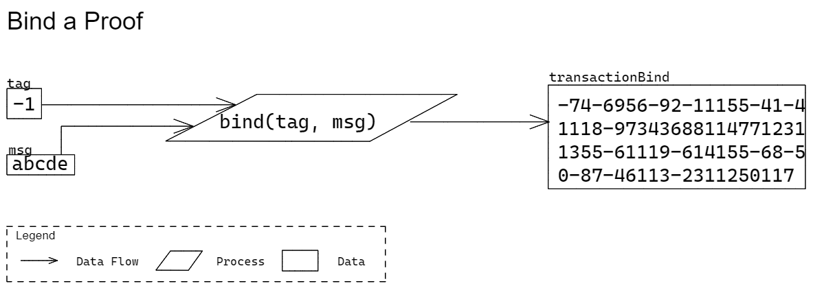

# Prover

Functions related to creating Proofs.

## Bind Proof

### Signature

` bind(tag: bytes, message: bytes) => bytes `

* Parameters
  * `tag`  
  An identifier of the Quivr operation. 
    * Type: `bytes`  
    This parameter should only contain a single byte. This specification denotes this type as `bytes` since Protobuf does not have a type for a single byte.
    * Required: true
  * `message`  
  Unique bytes from a transaction that will be bound to a proof.
    * Type: `bytes`
    * Required: true
* Return  
A transaction binding for a proof. Similar to a "signature".
  * Type: `bytes`

### Description

Generate a binding for a proof. This binding is a hash of the tag and message.

### Test Vectors

The test vectors represent the inputs and outputs of the following: language-agnostic pseudo code:

` binding = Quivr.Prover.bind(tag, message) `

> TODO: embed test vectors

## Prove Height Lock

### Signature

` proveHeight() => ((msg: bytes) => ProofHeightLock) `

* Parameters  
*None*
* Return  
A function to create a Height Lock Proof given a message to bound to.
  * Parameters
    * `msg`  
    A message to bind with the proof. This should represent unique bytes of the containing transaction.
      * Type: `bytes`
      * Required: true
  * Return  
  The created Height Lock Proof.
    * Type: `ProofHeightLock`

### Description

Create a Proof for a Height Lock Proposition.

### Test Vectors

The test vectors represent the inputs and outputs of the following language-agnostic pseudo code:

` proof = Quivr.Proposer.proveHeight()(msg) `

> TODO: embed test vectors