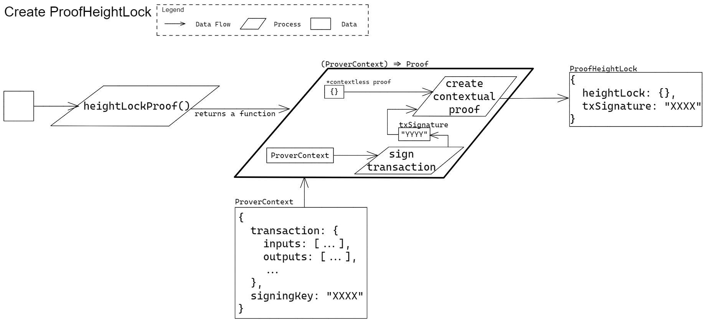

# Height Lock 

Prover Functions Specific to Height Lock

## Create a Height Lock Proof

### Signature

` heightLockProof() => ((ProverContext) => ProofHeightLock) `

> TODO: Explain parameters and return type

### Example Usage

` heightLockProof()(proverCtx) `

> TODO: make more comprehensive

### Description

Create a contextual height lock proof.

> TODO: add more

### Test Vectors

> TODO: embed test vectors