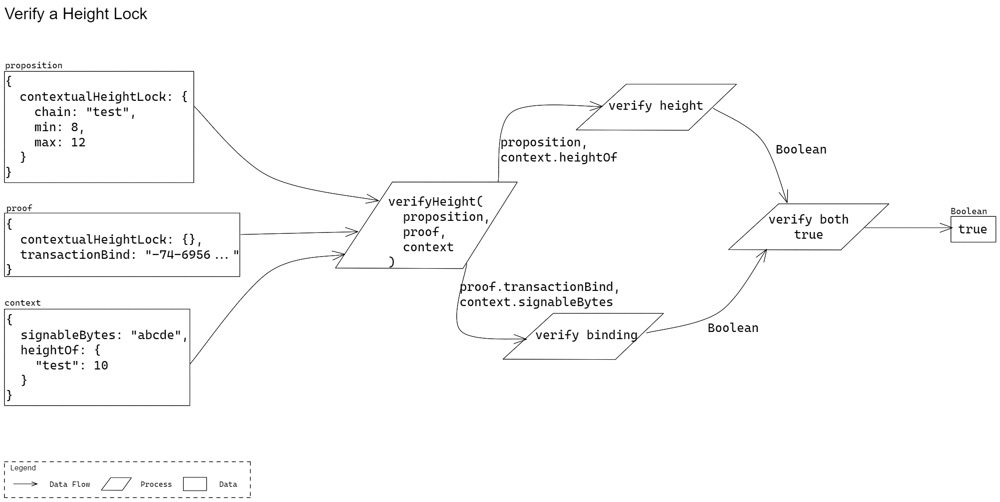

# Verifier

Functions related to verifying if a Proof satisfies a Proposition.

Various data types are used to describe the parameters and return types of the functions. These types are either the data types provided by [Protobuf](https://developers.google.com/protocol-buffers/docs/proto3) or will be defined in a separate [protobuf specifications repo](https://github.com/Topl/protobuf-specs/) from which language specific denitions will be generated. To denote a specific type given by Protobuf's `oneof`, the data types in this specification will make use of the following syntax: `ParentType[ChildType]`. For example, `Parent[Child1]` denotes the type `Parent` whose oneof-value is of type `Child1` given the following Protobuf definition:

```
message Parent {
  oneof sealed_value {
    Child1 c1 = 1;
    Child2 c2 = 2;
    ...
  }
}
```

## Verify Height Range

### Signature

```
verifyHeight(proposition: PropositionHeightLock, proof: ProofHeightLock) => ((ctx: EvaluationContext) => Boolean)
```

* Parameters
  * `proposition`  
  The Height Lock Proposition.
    * Type: `Proposition[PropositionContextualHeightLock]`
    * Required: true
  * `proof`  
  The Height Lock Proof.
    * Type: ``Proof[ProofContextualHeightLock]``
    * Required: true
* Return  
A function to verify the Height Lock Proof against the Height Lock Proposition given an evaluation context.
  * Parameters
    * `context`  
    A context to verify the Proposition and Proof against. It provides additional contextual information (such as height, transaction signable bytes and more) to the verifier.
      * Type: `DynamicContext`
      * Required: true
  * Return  
  A flag indicating if the proof is verified.
    * Type: `bool`

### Description

Verify that a given Height Lock Proof satisfies the given Height Lock Proposition and context. In order for Proofs to verified, the following two conditions must be satisfied:

* Proposition must be satisfied
* The Proof's binding verified.

To satisfy a Height Lock Proposition, the height requirements within the Proposition must be satisfied by the height of the blockchain (given by `chain` in the Proposition and `context`).

To verify the Proof's binding, the transactionBind within the Proof must match an expected binding that's created using the signable bytes of the transaction (given by `context`).

> TODO: Update diagram



### Test Vectors

The test vectors represent the inputs and outputs of the following language-agnostic pseudo code:

```
isValid = Quivr.Verifier.verifyHeight(proposition, proof)(ctx)
```

```json
[
  {
    "inputs": {
      "proposition": {
        "contextualHeightLock": {
          "chain": "test",
          "min": 8,
          "max": 12
        }
      },
      "proof": {
        "contextualHeightLock": {},
        "transactionBind": "-74-6956-92-11155-41-41118-973436881147712311355-61119-614155-68-50-87-46113-2311250117"
      },
      "context": {
        "signableBytes": "abcde",
        "heightOf": {
          "test": 10
        }
      }
    },
    "outputs": {
      "result": true
    },
    "errors": []
  },
  {
    "inputs": {
      "proposition": {
        "contextualHeightLock": {
          "chain": "test",
          "min": 8,
          "max": 9
        }
      },
      "proof": {
        "contextualHeightLock": {},
        "transactionBind": "-74-6956-92-11155-41-41118-973436881147712311355-61119-614155-68-50-87-46113-2311250117"
      },
      "context": {
        "signableBytes": "abcde",
        "heightOf": {
          "test": 10
        }
      }
    },
    "outputs": {
      "result": false
    },
    "errors": []
  },
  {
    "inputs": {
      "proposition": {
        "contextualHeightLock": {
          "chain": "test",
          "min": 8,
          "max": 12
        }
      },
      "proof": {
        "contextualHeightLock": {},
        "transactionBind": "-74-6956-92-11155-41-41118-973436881147712311355-61119-614155-68-50-87-46113-2311250117"
      },
      "context": {
        "signableBytes": "wxyz",
        "heightOf": {
          "test": 10
        }
      }
    },
    "outputs": {
      "result": true
    },
    "errors": []
  }
]
```