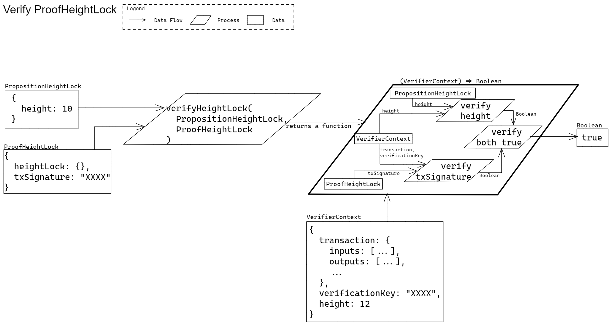

# Height Lock

Verifier Functions Specific to Height Lock

## Verify a Height Lock Proof

### Signature

` verifyHeightLock(PropositionHeightLock, ProofHeightLock) => ((VerifierContext) => Boolean) `

> TODO: Explain parameters and return type

### Example Usage

` verifyHeightLock(heightLockProp, heightLockProof)(verifierCtx) `

> TODO: make more comprehensive

### Description

Verify that a given proof to a height lock satisfies the given proposition and context. 

> TODO: add more

### Test Vectors

> TODO: embed test vectors