# Prove an Unproven Transaction

> TODO: Link to models

## Signature(s)

```
prove(unprovenTx: IoTransaction): Either[List[CredentiallerError], IoTransaction]
```

## Description

Prove an unproven IoTransaction. This involves adding proofs to the transaction inputs' attestations.

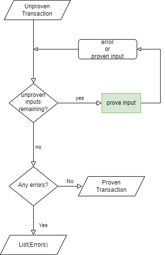

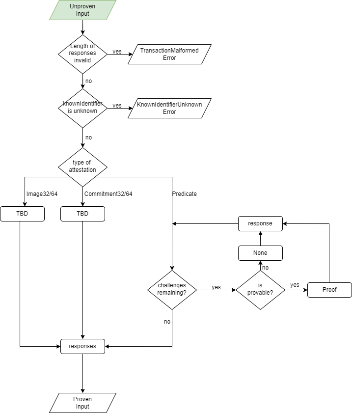

### Parameters

* `unprovenTx`  
    The transaction to prove.
    * Type: IoTransaction
    * Required

### Returns

Either[List[[CredentiallerError](../../Common/Models/Errors.md#credentiallererror)], IoTransaction]

The proven IoTransaction if possible. If not, a list of errors that occured.

## Testing Procedure

### Test Cases

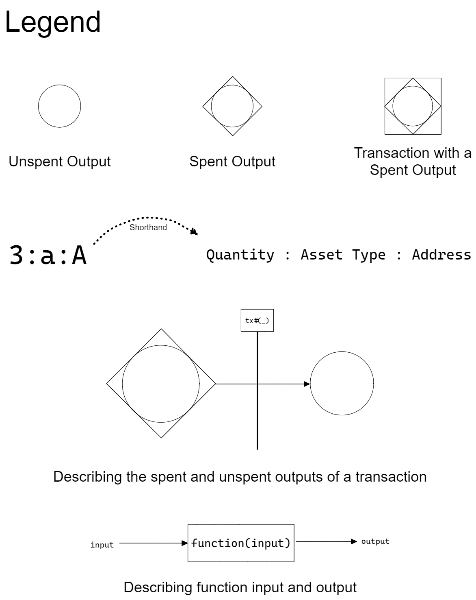

The following test cases only consider a transaction of 3 : a : A => 3 : a : B. That is, a single input to single output transaction where the quantity and asset type do not change but the Address does.

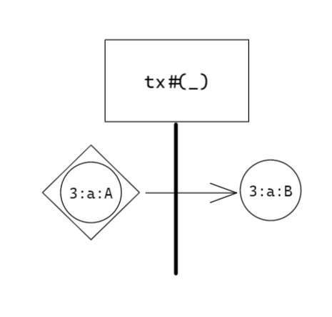

#### Transaction Input Referencing a KnownIdentifier Unknown to the Wallet

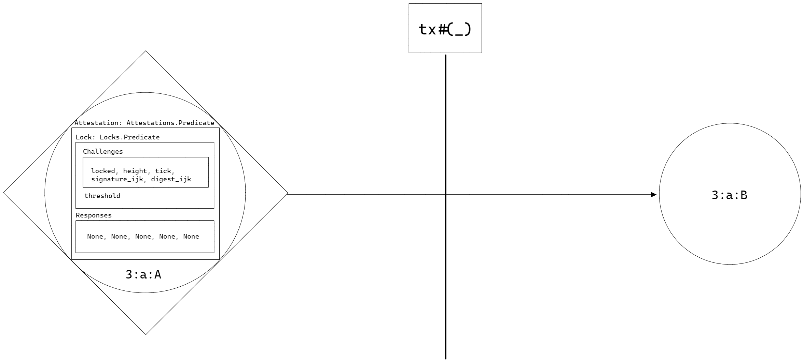

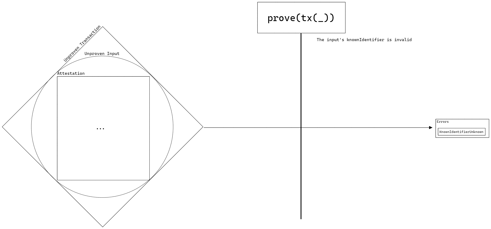

* **Given** `unprovenTx` is an IoTransaction with a single input that refers to a `knownIdentifier` that is unknown to the wallet
* **And** `lock.challenges` in the Attestation contains a Locked, Tick, Height, DigitalSignature, and Digest proposition
* **When**
    ```
    prove(unprovenTx: IoTransaction)
    ```
* **Then**
  Return the proven transaction containing proofs for Locked, Tick, and Height propositions and None for DigitalSignature and Digest propositions

```json
{
  "description": "Transaction Input Referencing a KnownIdentifier Unknown to the Wallet",
  "inputs": {
    "unprovenTx": {
      "inputs": [
        {
          "knownIdentifier": {
            "network": 0,
            "ledger": 0,
            "index": 0,
            "id": {
              "tag": "iotx_32",
              "evidence": "fake commitment that does not exist"
            }
          },
          "attestation": {
            "lock": {
              "challenges": [
                {"locked": {}},
                {"height": {"chain": "header", "min": 2, "max": 15}},
                {"tick": {"min": 2, "max": 15}},
                {"signature": {"routine": "ed25519", "vk": "verificationKey_ijk"}},
                {"digest": {"routine": "blake2b256", "digest": "digest_ijk"}}
              ], 
              "threshold": 1
            },
            "responses": [null, null, null, null, null]
          },
          "value": {"quantity": 1, "blobs": []},
          "datum": {"references": [], "metadata": []},
          "opts": []
        }
      ],
      "outputs": [],
      "datum": {
        "schedule": {"min": 1, "max": 100, "timestamp": 99999},
        "references32": [],
        "references64": [],
        "metadata": []
      }
    }
  },
  "outputs": {
    "right": {
      "inputs": [
        {
          "knownIdentifier": {
            "network": 0,
            "ledger": 0,
            "index": 0,
            "id": {
              "tag": "iotx_32",
              "evidence": "fake commitment that does not exist"
            }
          },
          "attestation": {
            "lock": {
              "challenges": [
                {"locked": {}},
                {"height": {"chain": "header", "min": 2, "max": 15}},
                {"tick": {"min": 2, "max": 15}},
                {"signature": {"routine": "ed25519", "vk": "verificationKey_ijk"}},
                {"digest": {"routine": "blake2b256", "digest": "digest_ijk"}}
              ], 
              "threshold": 1
            },
            "responses": [
              {"locked": {}},
              {"height": {"transactionBind": "xxxx"}},
              {"tick": {"transactionBind": "xxxx"}},
              null,
              null
            ]
          },
          "value": {"quantity": 1, "blobs": []},
          "datum": {"references": [], "metadata": []},
          "opts": []
        }
      ],
      "outputs": [],
      "datum": {
        "schedule": {"min": 1, "max": 100, "timestamp": 99999},
        "references32": [],
        "references64": [],
        "metadata": []
      }
    }
  }
}
```

#### Transaction Input with Attestation Type Image32/64

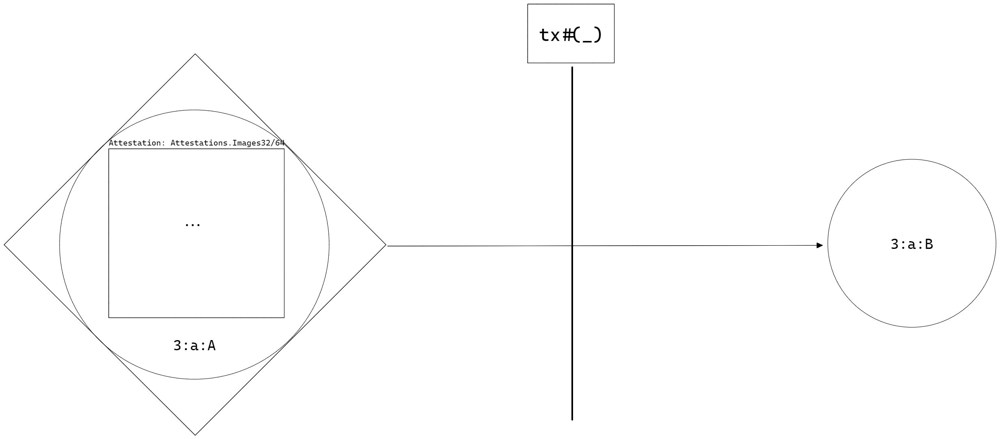

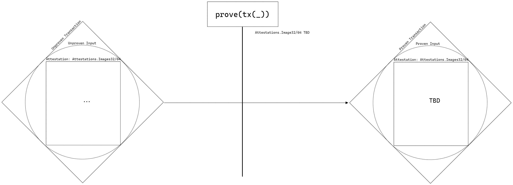

* **Given** `unprovenTx` is an IoTransaction with a single input with an attestation type `Image32` or `Image64`
* **When**
    ```
    prove(unprovenTx: IoTransaction)
    ```
* **Then**
  TBD

```json
{
  "description": "Transaction Input with Attestation Type Image32/64",
  "inputs": {
    "unprovenTx": {
      "inputs": [
        {
          "knownIdentifier": {
            "network": 0,
            "ledger": 0,
            "index": 0,
            "id": {
              "tag": "iotx_32",
              "evidence": "real commitment that does exist"
            }
          },
          "attestation": {
            "lock": {"leaves": [], "threshold": 0},
            "known": [],
            "responses": []
          },
          "value": {"quantity": 1, "blobs": []},
          "datum": {"references": [], "metadata": []},
          "opts": []
        }
      ],
      "outputs": [],
      "datum": {
        "schedule": {"min": 1, "max": 100, "timestamp": 99999},
        "references32": [],
        "references64": [],
        "metadata": []
      }
    }
  },
  "outputs": "TBD"
}
```

#### Transaction Input with Attestation Type Commitment32/64

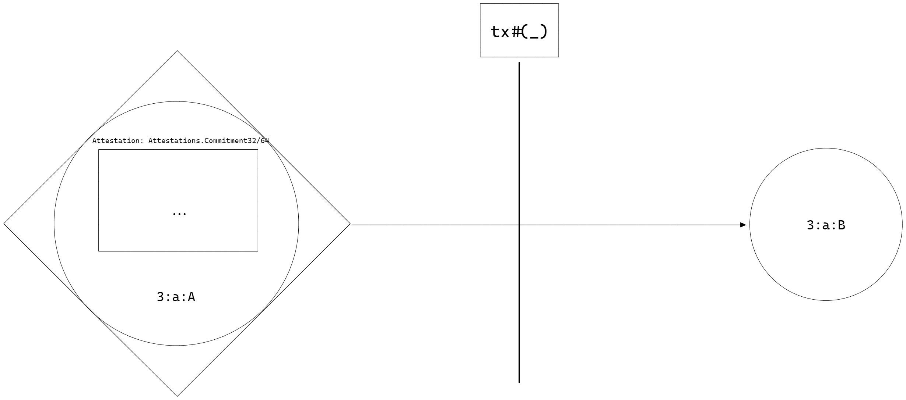

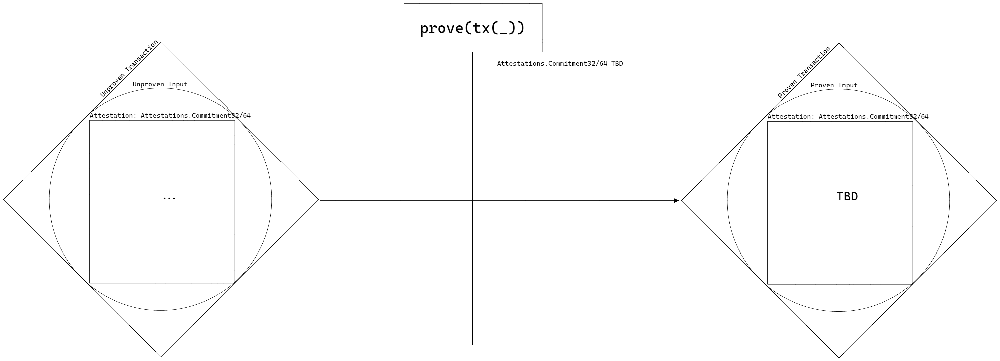

* **Given** `unprovenTx` is an IoTransaction with a single input with an attestation type `Commitment32` or `Commitment64`
* **When**
    ```
    prove(unprovenTx: IoTransaction)
    ```
* **Then**
  TBD

```json
{
  "description": "Transaction Input with Attestation Type Commitment32/64",
  "inputs": {
    "unprovenTx": {
      "inputs": [
        {
          "knownIdentifier": {
            "network": 0,
            "ledger": 0,
            "index": 0,
            "id": {
              "tag": "iotx_32",
              "evidence": "real commitment that does exist"
            }
          },
          "attestation": {
            "lock": {"root": "", "threshold": 0},
            "known": [],
            "responses": []
          },
          "value": {"quantity": 1, "blobs": []},
          "datum": {"references": [], "metadata": []},
          "opts": []
        }
      ],
      "outputs": [],
      "datum": {
        "schedule": {"min": 1, "max": 100, "timestamp": 99999},
        "references32": [],
        "references64": [],
        "metadata": []
      }
    }
  },
  "outputs": "TBD"
}
```

#### Transaction Input with Attestation Type Predicate Whose Challenges and Responses Lengths Differ 

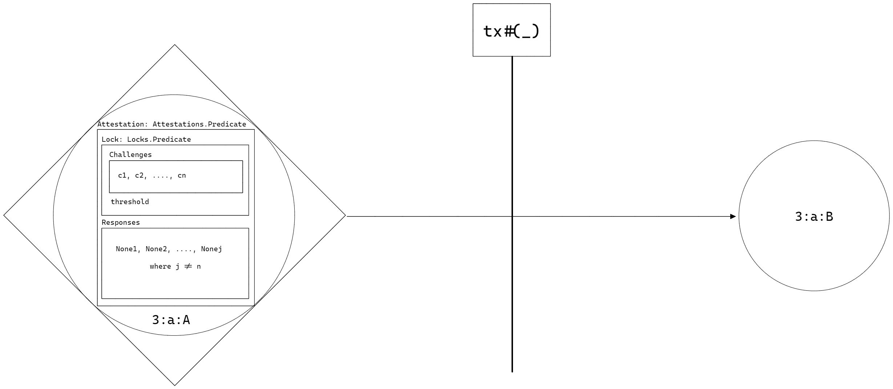

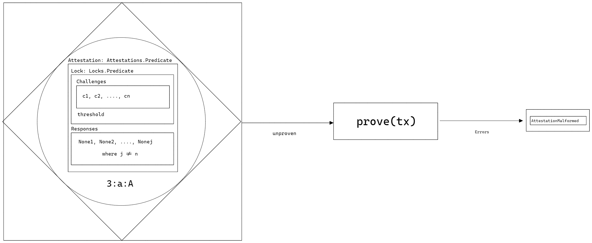

* **Given** `unprovenTx` is an IoTransaction with a single input with an attestation type `Predicate`
* **And** the length of `responses` and length of `lock.challenges` do not match
* **When**
    ```
    prove(unprovenTx: IoTransaction)
    ```
* **Then**
  A list containing the error [`CR002`](../../Common/Models/Errors.md#cr002-attestationmalformed) is returned

```json
{
  "description": "Transaction Input with Attestation Type Predicate Whose Challenges and Responses Lengths Differ",
  "inputs": {
    "unprovenTx": {
      "inputs": [
        {
          "knownIdentifier": {
            "network": 0,
            "ledger": 0,
            "index": 0,
            "id": {
              "tag": "iotx_32",
              "evidence": "real commitment that does exist"
            }
          },
          "attestation": {
            "lock": {
              "challenges": [
                {"locked": {}},
                {"tickRange": {"min": 2, "max": 10}}
              ], 
              "threshold": 1
            },
            "responses": [null]
          },
          "value": {"quantity": 1, "blobs": []},
          "datum": {"references": [], "metadata": []},
          "opts": []
        }
      ],
      "outputs": [],
      "datum": {
        "schedule": {"min": 1, "max": 100, "timestamp": 99999},
        "references32": [],
        "references64": [],
        "metadata": []
      }
    }
  },
  "outputs": {
    "left": ["CredentiallerError.AttestationMalformed"]
  }
}
```

#### Transaction Input with Attestation Type Predicate With Proof That Requires Secret Data (Available)

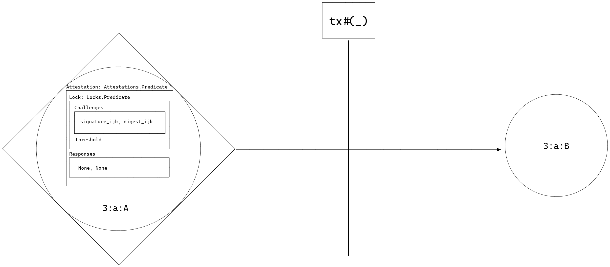

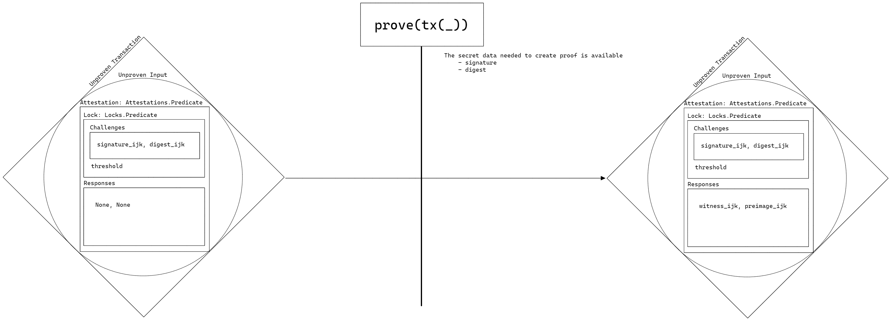

* **Given** `unprovenTx` is an IoTransaction with a single input with an attestation type `Predicate`
* **And** the challenges in the predicate require access to secret data
* **And** the wallet has access to that data
* **When**
    ```
    prove(unprovenTx: IoTransaction)
    ```
* **Then**
  The proven transaction is returned

```json
{
  "description": "Transaction Input with Attestation Type Predicate With Proof That Requires Secret Data (Available)",
  "inputs": {
    "unprovenTx": {
      "inputs": [
        {
          "knownIdentifier": {
            "network": 0,
            "ledger": 0,
            "index": 0,
            "id": {
              "tag": "iotx_32",
              "evidence": "real commitment that does exist"
            }
          },
          "attestation": {
            "lock": {
              "challenges": [
                {"signature": {"routine": "ed25519", "vk": "verificationKey_ijk"}},
                {"digest": {"routine": "blake2b256", "digest": "digest_ijk"}}
              ], 
              "threshold": 1
            },
            "responses": [null, null]
          },
          "value": {"quantity": 1, "blobs": []},
          "datum": {"references": [], "metadata": []},
          "opts": []
        }
      ],
      "outputs": [],
      "datum": {
        "schedule": {"min": 1, "max": 100, "timestamp": 99999},
        "references32": [],
        "references64": [],
        "metadata": []
      }
    }
  },
  "outputs": {
    "right": {
      "inputs": [
        {
          "knownIdentifier": {
            "network": 0,
            "ledger": 0,
            "index": 0,
            "id": {
              "tag": "iotx_32",
              "evidence": "real commitment that does exist"
            }
          },
          "attestation": {
            "lock": {
              "challenges": [
                {"signature": {"routine": "ed25519", "vk": "verificationKey_ijk"}},
                {"digest": {"routine": "blake2b256", "digest": "digest_ijk"}}
              ], 
              "threshold": 1
            },
            "responses": [
              {"signature": {"transactionBind": "xxxx", "witness": "witness_ijk"}},
              {"digest": {"transactionBind": "xxxx", "preimage": "preimage_ijk"}}
            ]
          },
          "value": {"quantity": 1, "blobs": []},
          "datum": {"references": [], "metadata": []},
          "opts": []
        }
      ],
      "outputs": [],
      "datum": {
        "schedule": {"min": 1, "max": 100, "timestamp": 99999},
        "references32": [],
        "references64": [],
        "metadata": []
      }
    }
  }
}
```

#### Transaction Input with Attestation Type Predicate With Proof That Requires Secret Data (Unavailable)


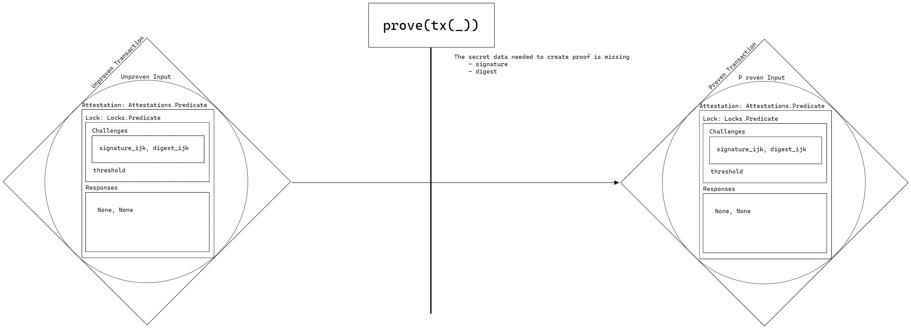

* **Given** `unprovenTx` is an IoTransaction with a single input with an attestation type `Predicate`
* **And** the challenges in the predicate require access to secret data
* **And** the wallet does not have access to that data
* **When**
    ```
    prove(unprovenTx: IoTransaction)
    ```
* **Then**
    The unmodified transaction is returned.

```json
{
  "description": "Transaction Input with Attestation Type Predicate With Proof That Requires Secret Data (Unavailable)",
  "inputs": {
    "unprovenTx": {
      "inputs": [
        {
          "knownIdentifier": {
            "network": 0,
            "ledger": 0,
            "index": 0,
            "id": {
              "tag": "iotx_32",
              "evidence": "real commitment that does exist"
            }
          },
          "attestation": {
            "lock": {
              "challenges": [
                {"signature": {"routine": "ed25519", "vk": "verificationKey_ijk"}},
                {"digest": {"routine": "blake2b256", "digest": "digest_ijk"}}
              ], 
              "threshold": 1
            },
            "responses": [null, null]
          },
          "value": {"quantity": 1, "blobs": []},
          "datum": {"references": [], "metadata": []},
          "opts": []
        }
      ],
      "outputs": [],
      "datum": {
        "schedule": {"min": 1, "max": 100, "timestamp": 99999},
        "references32": [],
        "references64": [],
        "metadata": []
      }
    }
  },
  "outputs": {
    "right": {
      "inputs": [
        {
          "knownIdentifier": {
            "network": 0,
            "ledger": 0,
            "index": 0,
            "id": {
              "tag": "iotx_32",
              "evidence": "real commitment that does exist"
            }
          },
          "attestation": {
            "lock": {
              "challenges": [
                {"signature": {"routine": "ed25519", "vk": "verificationKey_ijk"}},
                {"digest": {"routine": "blake2b256", "digest": "digest_ijk"}}
              ], 
              "threshold": 1
            },
            "responses": [null, null]
          },
          "value": {"quantity": 1, "blobs": []},
          "datum": {"references": [], "metadata": []},
          "opts": []
        }
      ],
      "outputs": [],
      "datum": {
        "schedule": {"min": 1, "max": 100, "timestamp": 99999},
        "references32": [],
        "references64": [],
        "metadata": []
      }
    }
  }
}
```

#### Transaction Input with Attestation Type Predicate With Proof That Does Not Require Secret Data


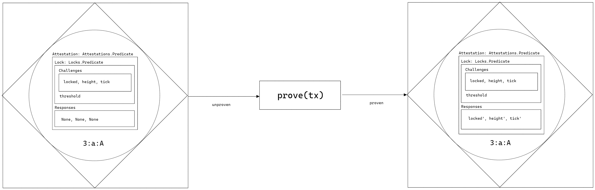

* **Given** `unprovenTx` is an IoTransaction with a single input with an attestation type `Predicate`
* **And** the challenges in the predicate do not require access to secret data
* **When**
    ```
    prove(unprovenTx: IoTransaction)
    ```
* **Then**
  The proven transaction is returned

```json
{
  "description": "Transaction Input with Attestation Type Predicate With Proof That Does Not Require Secret Data",
  "inputs": {
    "unprovenTx": {
      "inputs": [
        {
          "knownIdentifier": {
            "network": 0,
            "ledger": 0,
            "index": 0,
            "id": {
              "tag": "iotx_32",
              "evidence": "real commitment that does exist"
            }
          },
          "attestation": {
            "lock": {
              "challenges": [
                {"locked": {}},
                {"height": {"chain": "header", "min": 2, "max": 15}},
                {"tick": {"min": 2, "max": 15}}
              ], 
              "threshold": 1
            },
            "responses": [null, null, null]
          },
          "value": {"quantity": 1, "blobs": []},
          "datum": {"references": [], "metadata": []},
          "opts": []
        }
      ],
      "outputs": [],
      "datum": {
        "schedule": {"min": 1, "max": 100, "timestamp": 99999},
        "references32": [],
        "references64": [],
        "metadata": []
      }
    }
  },
  "outputs": {
    "right": {
      "inputs": [
        {
          "knownIdentifier": {
            "network": 0,
            "ledger": 0,
            "index": 0,
            "id": {
              "tag": "iotx_32",
              "evidence": "real commitment that does exist"
            }
          },
          "attestation": {
            "lock": {
              "challenges": [
                {"locked": {}},
                {"height": {"chain": "header", "min": 2, "max": 15}},
                {"tick": {"min": 2, "max": 15}}
              ], 
              "threshold": 1
            },
            "responses": [
              {"locked": {}},
              {"height": {"transactionBind": "xxxx"}},
              {"tick": {"transactionBind": "xxxx"}}
            ]
          },
          "value": {"quantity": 1, "blobs": []},
          "datum": {"references": [], "metadata": []},
          "opts": []
        }
      ],
      "outputs": [],
      "datum": {
        "schedule": {"min": 1, "max": 100, "timestamp": 99999},
        "references32": [],
        "references64": [],
        "metadata": []
      }
    }
  }
}
```

### Test Vectors

```json
[
{
    "description": "Transaction Input Referencing a KnownIdentifier Unknown to the Wallet",
    "inputs": {
      "unprovenTx": {
        "inputs": [
          {
            "knownIdentifier": {
              "network": 0,
              "ledger": 0,
              "index": 0,
              "id": {
                "tag": "iotx_32",
                "evidence": "fake commitment that does not exist"
              }
            },
            "attestation": {
              "lock": {
                "challenges": [
                  {"locked": {}},
                  {"height": {"chain": "header", "min": 2, "max": 15}},
                  {"tick": {"min": 2, "max": 15}},
                  {"signature": {"routine": "ed25519", "vk": "verificationKey_ijk"}},
                  {"digest": {"routine": "blake2b256", "digest": "digest_ijk"}}
                ], 
                "threshold": 1
              },
              "responses": [null, null, null, null, null]
            },
            "value": {"quantity": 1, "blobs": []},
            "datum": {"references": [], "metadata": []},
            "opts": []
          }
        ],
        "outputs": [],
        "datum": {
          "schedule": {"min": 1, "max": 100, "timestamp": 99999},
          "references32": [],
          "references64": [],
          "metadata": []
        }
      }
    },
    "outputs": {
      "right": {
        "inputs": [
          {
            "knownIdentifier": {
              "network": 0,
              "ledger": 0,
              "index": 0,
              "id": {
                "tag": "iotx_32",
                "evidence": "fake commitment that does not exist"
              }
            },
            "attestation": {
              "lock": {
                "challenges": [
                  {"locked": {}},
                  {"height": {"chain": "header", "min": 2, "max": 15}},
                  {"tick": {"min": 2, "max": 15}},
                  {"signature": {"routine": "ed25519", "vk": "verificationKey_ijk"}},
                  {"digest": {"routine": "blake2b256", "digest": "digest_ijk"}}
                ], 
                "threshold": 1
              },
              "responses": [
                {"locked": {}},
                {"height": {"transactionBind": "xxxx"}},
                {"tick": {"transactionBind": "xxxx"}},
                null,
                null
              ]
            },
            "value": {"quantity": 1, "blobs": []},
            "datum": {"references": [], "metadata": []},
            "opts": []
          }
        ],
        "outputs": [],
        "datum": {
          "schedule": {"min": 1, "max": 100, "timestamp": 99999},
          "references32": [],
          "references64": [],
          "metadata": []
        }
      }
    }
  },  
  {
    "description": "Transaction Input with Attestation Type Image32/64",
    "inputs": {
      "unprovenTx": {
        "inputs": [
          {
            "knownIdentifier": {
              "network": 0,
              "ledger": 0,
              "index": 0,
              "id": {
                "tag": "iotx_32",
                "evidence": "real commitment that does exist"
              }
            },
            "attestation": {
              "lock": {"leaves": [], "threshold": 0},
              "known": [],
              "responses": []
            },
            "value": {"quantity": 1, "blobs": []},
            "datum": {"references": [], "metadata": []},
            "opts": []
          }
        ],
        "outputs": [],
        "datum": {
          "schedule": {"min": 1, "max": 100, "timestamp": 99999},
          "references32": [],
          "references64": [],
          "metadata": []
        }
      }
    },
    "outputs": "TBD"
  },
  {
    "description": "Transaction Input with Attestation Type Commitment32/64",
    "inputs": {
      "unprovenTx": {
        "inputs": [
          {
            "knownIdentifier": {
              "network": 0,
              "ledger": 0,
              "index": 0,
              "id": {
                "tag": "iotx_32",
                "evidence": "real commitment that does exist"
              }
            },
            "attestation": {
              "lock": {"root": "", "threshold": 0},
              "known": [],
              "responses": []
            },
            "value": {"quantity": 1, "blobs": []},
            "datum": {"references": [], "metadata": []},
            "opts": []
          }
        ],
        "outputs": [],
        "datum": {
          "schedule": {"min": 1, "max": 100, "timestamp": 99999},
          "references32": [],
          "references64": [],
          "metadata": []
        }
      }
    },
    "outputs": "TBD"
  },
  {
    "description": "Transaction Input with Attestation Type Predicate Whose Challenges and Responses Lengths Differ",
    "inputs": {
      "unprovenTx": {
        "inputs": [
          {
            "knownIdentifier": {
              "network": 0,
              "ledger": 0,
              "index": 0,
              "id": {
                "tag": "iotx_32",
                "evidence": "real commitment that does exist"
              }
            },
            "attestation": {
              "lock": {
                "challenges": [
                  {"locked": {}},
                  {"tickRange": {"min": 2, "max": 10}}
                ], 
                "threshold": 1
              },
              "responses": [null]
            },
            "value": {"quantity": 1, "blobs": []},
            "datum": {"references": [], "metadata": []},
            "opts": []
          }
        ],
        "outputs": [],
        "datum": {
          "schedule": {"min": 1, "max": 100, "timestamp": 99999},
          "references32": [],
          "references64": [],
          "metadata": []
        }
      }
    },
    "outputs": {
      "left": ["CredentiallerError.AttestationMalformed"]
    }
  },
  {
    "description": "Transaction Input with Attestation Type Predicate With Proof That Requires Secret Data (Available)",
    "inputs": {
      "unprovenTx": {
        "inputs": [
          {
            "knownIdentifier": {
              "network": 0,
              "ledger": 0,
              "index": 0,
              "id": {
                "tag": "iotx_32",
                "evidence": "real commitment that does exist"
              }
            },
            "attestation": {
              "lock": {
                "challenges": [
                  {"signature": {"routine": "ed25519", "vk": "verificationKey_ijk"}},
                  {"digest": {"routine": "blake2b256", "digest": "digest_ijk"}}
                ], 
                "threshold": 1
              },
              "responses": [null, null]
            },
            "value": {"quantity": 1, "blobs": []},
            "datum": {"references": [], "metadata": []},
            "opts": []
          }
        ],
        "outputs": [],
        "datum": {
          "schedule": {"min": 1, "max": 100, "timestamp": 99999},
          "references32": [],
          "references64": [],
          "metadata": []
        }
      }
    },
    "outputs": {
      "right": {
        "inputs": [
          {
            "knownIdentifier": {
              "network": 0,
              "ledger": 0,
              "index": 0,
              "id": {
                "tag": "iotx_32",
                "evidence": "real commitment that does exist"
              }
            },
            "attestation": {
              "lock": {
                "challenges": [
                  {"signature": {"routine": "ed25519", "vk": "verificationKey_ijk"}},
                  {"digest": {"routine": "blake2b256", "digest": "digest_ijk"}}
                ], 
                "threshold": 1
              },
              "responses": [
                {"signature": {"transactionBind": "xxxx", "witness": "witness_ijk"}},
                {"digest": {"transactionBind": "xxxx", "preimage": "preimage_ijk"}}
              ]
            },
            "value": {"quantity": 1, "blobs": []},
            "datum": {"references": [], "metadata": []},
            "opts": []
          }
        ],
        "outputs": [],
        "datum": {
          "schedule": {"min": 1, "max": 100, "timestamp": 99999},
          "references32": [],
          "references64": [],
          "metadata": []
        }
      }
    }
  },
  {
    "description": "Transaction Input with Attestation Type Predicate With Proof That Requires Secret Data (Unavailable)",
    "inputs": {
      "unprovenTx": {
        "inputs": [
          {
            "knownIdentifier": {
              "network": 0,
              "ledger": 0,
              "index": 0,
              "id": {
                "tag": "iotx_32",
                "evidence": "real commitment that does exist"
              }
            },
            "attestation": {
              "lock": {
                "challenges": [
                  {"signature": {"routine": "ed25519", "vk": "verificationKey_ijk"}},
                  {"digest": {"routine": "blake2b256", "digest": "digest_ijk"}}
                ], 
                "threshold": 1
              },
              "responses": [null, null]
            },
            "value": {"quantity": 1, "blobs": []},
            "datum": {"references": [], "metadata": []},
            "opts": []
          }
        ],
        "outputs": [],
        "datum": {
          "schedule": {"min": 1, "max": 100, "timestamp": 99999},
          "references32": [],
          "references64": [],
          "metadata": []
        }
      }
    },
    "outputs": {
      "right": {
        "inputs": [
          {
            "knownIdentifier": {
              "network": 0,
              "ledger": 0,
              "index": 0,
              "id": {
                "tag": "iotx_32",
                "evidence": "real commitment that does exist"
              }
            },
            "attestation": {
              "lock": {
                "challenges": [
                  {"signature": {"routine": "ed25519", "vk": "verificationKey_ijk"}},
                  {"digest": {"routine": "blake2b256", "digest": "digest_ijk"}}
                ], 
                "threshold": 1
              },
              "responses": [null, null]
            },
            "value": {"quantity": 1, "blobs": []},
            "datum": {"references": [], "metadata": []},
            "opts": []
          }
        ],
        "outputs": [],
        "datum": {
          "schedule": {"min": 1, "max": 100, "timestamp": 99999},
          "references32": [],
          "references64": [],
          "metadata": []
        }
      }
    }
  },
  {
    "description": "Transaction Input with Attestation Type Predicate With Proof That Does Not Require Secret Data",
    "inputs": {
      "unprovenTx": {
        "inputs": [
          {
            "knownIdentifier": {
              "network": 0,
              "ledger": 0,
              "index": 0,
              "id": {
                "tag": "iotx_32",
                "evidence": "real commitment that does exist"
              }
            },
            "attestation": {
              "lock": {
                "challenges": [
                  {"locked": {}},
                  {"height": {"chain": "header", "min": 2, "max": 15}},
                  {"tick": {"min": 2, "max": 15}}
                ], 
                "threshold": 1
              },
              "responses": [null, null, null]
            },
            "value": {"quantity": 1, "blobs": []},
            "datum": {"references": [], "metadata": []},
            "opts": []
          }
        ],
        "outputs": [],
        "datum": {
          "schedule": {"min": 1, "max": 100, "timestamp": 99999},
          "references32": [],
          "references64": [],
          "metadata": []
        }
      }
    },
    "outputs": {
      "right": {
        "inputs": [
          {
            "knownIdentifier": {
              "network": 0,
              "ledger": 0,
              "index": 0,
              "id": {
                "tag": "iotx_32",
                "evidence": "real commitment that does exist"
              }
            },
            "attestation": {
              "lock": {
                "challenges": [
                  {"locked": {}},
                  {"height": {"chain": "header", "min": 2, "max": 15}},
                  {"tick": {"min": 2, "max": 15}}
                ], 
                "threshold": 1
              },
              "responses": [
                {"locked": {}},
                {"height": {"transactionBind": "xxxx"}},
                {"tick": {"transactionBind": "xxxx"}}
              ]
            },
            "value": {"quantity": 1, "blobs": []},
            "datum": {"references": [], "metadata": []},
            "opts": []
          }
        ],
        "outputs": [],
        "datum": {
          "schedule": {"min": 1, "max": 100, "timestamp": 99999},
          "references32": [],
          "references64": [],
          "metadata": []
        }
      }
    }
  }
]
```