# Validate a Proven Transaction

> TODO: Link to models

## Signature(s)

```
validate(tx: IoTransaction, ctx: DynamicContext): List[CredentiallerError]
```

## Description

Validate if an IoTransaction is satisfactorily proven. An IoTransaction is satisfactorily proven if the attestations of all inputs have their threshold met.

> TODO: Add diagram

### Parameters

* `tx`  
    The transaction to validate.
    * Type: IoTransaction
    * Required
* `ctx`  
    The context in which to validate the transaction.
    * Type: DynamicContext
    * Required

### Returns

List[[CredentiallerError](../../Common/Models/Errors.md#credentiallererror)

The list of validation errors that occured, if any.

## Testing Procedure

### Test Cases

The following test cases only consider a transaction of 3 : a : A => 3 : a : B. That is, a single input to single output transaction where the quantity and asset type do not change but the Address does.

#### Transaction Input with Attestation Type Image32/64

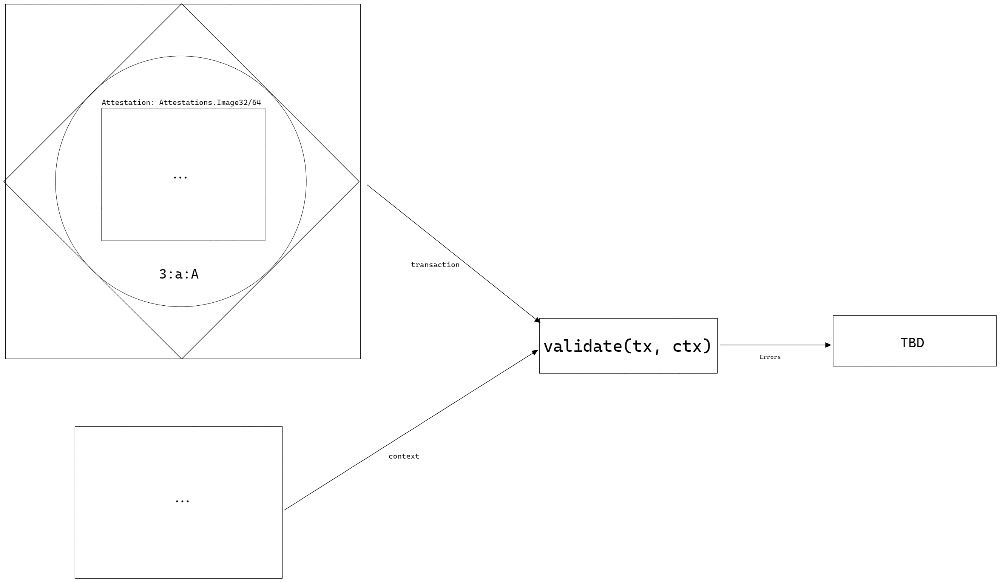

* **Given** `tx` is an IoTransaction with a single input with an attestation type `Image32` or `Image64`
* **And** `ctx` is an arbitrary DynamicContext
* **When**
    ```
    validate(tx: IoTransaction, ctx: DynamicContext)
    ```
* **Then**
  TBD

```json
{
  "description": "Transaction Input with Attestation Type Image32/64",
  "inputs": {
    "tx": {
      "inputs": [
        {
          "knownIdentifier": {
            "network": 0,
            "ledger": 0,
            "index": 0,
            "id": {
              "tag": "iotx_32",
              "evidence": "real commitment that does exist"
            }
          },
          "attestation": {
            "lock": {"leaves": [], "threshold": 0},
            "known": [],
            "responses": []
          },
          "value": {"quantity": 1, "blobs": []},
          "datum": {"references": [], "metadata": []},
          "opts": []
        }
      ],
      "outputs": [],
      "datum": {
        "schedule": {"min": 1, "max": 100, "timestamp": 99999},
        "references32": [],
        "references64": [],
        "metadata": []
      }
    },
    "ctx": {
      "signableBytes": "xxxx",
      "currentTick": 10,
      "datums": {"header": {"height": 10}},
      "signingRoutines": {"curve25519": {"verify": "curve25519 verification"}},
      "hashingRoutines": {"blake2b256": {"verify": "blake2b256 verification"}}
    }
  },
  "outputs": "TBD"
}
```

#### Transaction Input with Attestation Type Commitment32/64

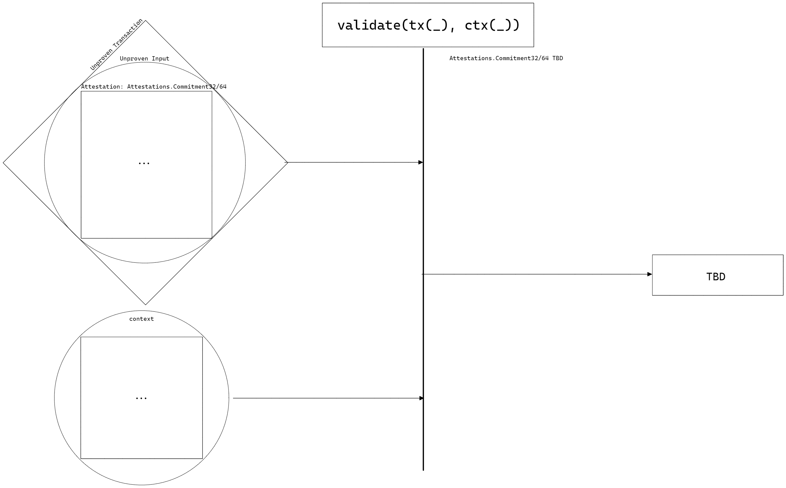

* **Given** `tx` is an IoTransaction with a single input with an attestation type `Commitment32` or `Commitment64`
* **And** `ctx` is an arbitrary DynamicContext
* **When**
    ```
    validate(tx: IoTransaction, ctx: DynamicContext)
    ```
* **Then**
  TBD

```json
{
  "description": "Transaction Input with Attestation Type Commitment32/64",
  "inputs": {
    "tx": {
      "inputs": [
        {
          "knownIdentifier": {
            "network": 0,
            "ledger": 0,
            "index": 0,
            "id": {
              "tag": "iotx_32",
              "evidence": "real commitment that does exist"
            }
          },
          "attestation": {
            "lock": {"root": "", "threshold": 0},
            "known": [],
            "responses": []
          },
          "value": {"quantity": 1, "blobs": []},
          "datum": {"references": [], "metadata": []},
          "opts": []
        }
      ],
      "outputs": [],
      "datum": {
        "schedule": {"min": 1, "max": 100, "timestamp": 99999},
        "references32": [],
        "references64": [],
        "metadata": []
      }
    },
    "ctx": {
      "signableBytes": "xxxx",
      "currentTick": 10,
      "datums": {"header": {"height": 10}},
      "signingRoutines": {"curve25519": {"verify": "curve25519 verification"}},
      "hashingRoutines": {"blake2b256": {"verify": "blake2b256 verification"}}
    }
  },
  "outputs": "TBD"
}
```

#### Transaction Input with Proofs Whose TransactionBind Does Not Match the Context SignableBytes


* **Given** `tx` is an IoTransaction with a single input with an attestation with proofs that are bound to `tx`
* **And** `ctx` is a DynamicContext containing arbitrary `signableBytes` unrelated to `tx`
* **When**
    ```
    validate(tx: IoTransaction, ctx: DynamicContext)
    ```
* **Then**
  A list containing the error [`CR003`](../../Common/Models/Errors.md#cr003-validationerror) is returned

```json
{
  "description": "Transaction Input with Proofs Whose TransactionBind Does Not Match the Context SignableBytes",
  "inputs": {
    "unprovenTx": {
      "inputs": [
        {
          "knownIdentifier": {
            "network": 0,
            "ledger": 0,
            "index": 0,
            "id": {
              "tag": "iotx_32",
              "evidence": "real commitment that does exist"
            }
          },
          "attestation": {
            "lock": {
              "challenges": [
                {"locked": {}},
                {"signature": {"routine": "curve25519", "vk": "verificationKey_ijk"}},
                {"digest": {"routine": "blake2b256", "digest": "digest_ijk"}},
                {"heightRange": {"chain": "header", "min": 2, "max": 15}},
                {"tickRange": {"min": 2, "max": 15}}
              ], 
              "threshold": 1
            },
            "responses": [
              {"locked": {}},
              {"signature": {"transactionBind": "txBind", "witness": "witness_ijk"}},
              {"digest": {"transactionBind": "txBind", "preimage": "preimage_ijk"}},
              {"heightRange": {"transactionBind": "txBind"}},
              {"tickRange": {"transactionBind": "txBind"}}
            ]
          },
          "value": {"quantity": 1, "blobs": []},
          "datum": {"references": [], "metadata": []},
          "opts": []
        }
      ],
      "outputs": [],
      "datum": {
        "schedule": {"min": 1, "max": 100, "timestamp": 99999},
        "references32": [],
        "references64": [],
        "metadata": []
      }
    },
    "ctx": {
      "signableBytes": "wrong signable bytes",
      "currentTick": 10,
      "datums": {"header": {"height": 10}},
      "signingRoutines": {"curve25519": {"verify": "curve25519 verification"}},
      "hashingRoutines": {"blake2b256": {"verify": "blake2b256 verification"}}
    }
  },
  "outputs": ["CR003: ValidationError"]
}
```

#### Transaction Input with Attestation Type Predicate Whose Threshold is Unobtainable

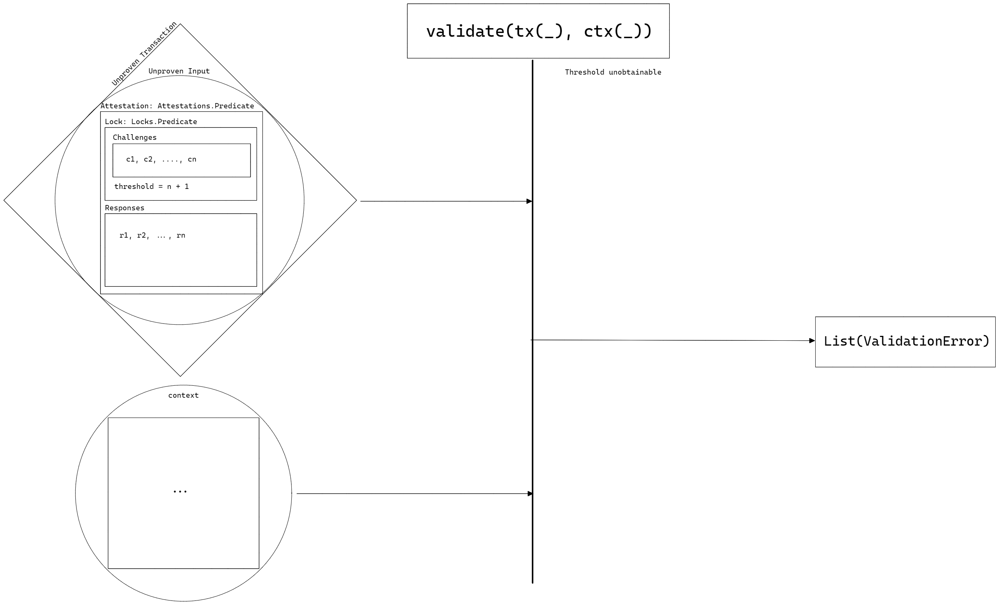

* **Given** `tx` is an IoTransaction with a single input with an attestation `Predicate` with `challenges` and `responses` having length 5
* **And** The predicate's threshold is 6
* **And** `ctx` is an arbitrary DynamicContext
* **When**
    ```
    validate(tx: IoTransaction, ctx: DynamicContext)
    ```
* **Then**
  A list containing the error [`CR003`](../../Common/Models/Errors.md#cr003-validationerror) is returned

```json
{
  "description": "Transaction Input with Attestation Type Predicate Whose Threshold is Unobtainable",
  "inputs": {
    "unprovenTx": {
      "inputs": [
        {
          "knownIdentifier": {
            "network": 0,
            "ledger": 0,
            "index": 0,
            "id": {
              "tag": "iotx_32",
              "evidence": "real commitment that does exist"
            }
          },
          "attestation": {
            "lock": {
              "challenges": [
                {"locked": {}},
                {"signature": {"routine": "curve25519", "vk": "verificationKey_ijk"}},
                {"digest": {"routine": "blake2b256", "digest": "digest_ijk"}},
                {"heightRange": {"chain": "header", "min": 2, "max": 15}},
                {"tickRange": {"min": 2, "max": 15}}
              ], 
              "threshold": 6
            },
            "responses": [
              {"locked": {}},
              {"signature": {"transactionBind": "txBind", "witness": "witness_ijk"}},
              {"digest": {"transactionBind": "txBind", "preimage": "preimage_ijk"}},
              {"heightRange": {"transactionBind": "txBind"}},
              {"tickRange": {"transactionBind": "txBind"}}
            ]
          },
          "value": {"quantity": 1, "blobs": []},
          "datum": {"references": [], "metadata": []},
          "opts": []
        }
      ],
      "outputs": [],
      "datum": {
        "schedule": {"min": 1, "max": 100, "timestamp": 99999},
        "references32": [],
        "references64": [],
        "metadata": []
      }
    },
    "ctx": {
      "signableBytes": "txBind",
      "currentTick": 10,
      "datums": {"header": {"height": 10}},
      "signingRoutines": {"curve25519": {"verify": "curve25519 verification"}},
      "hashingRoutines": {"blake2b256": {"verify": "blake2b256 verification"}}
    }
  },
  "outputs": ["CR003: ValidationError"]
}
```

#### Transaction Input with Attestation Type Predicate And Locked Challenge

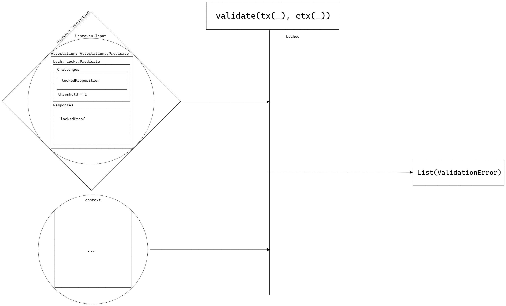

* **Given** `tx` is an IoTransaction with a single input with an attestation `Predicate` with only a locked proposition in the `challenges`
* **And** A locked proof in the `responses`
* **And** The predicate's threshold is 1
* **And** `ctx` is an arbitrary DynamicContext
* **When**
    ```
    validate(tx: IoTransaction, ctx: DynamicContext)
    ```
* **Then**
  A list containing the error [`CR003`](../../Common/Models/Errors.md#cr003-validationerror) is returned

```json
{
  "description": "Transaction Input with Attestation Type Predicate And Locked Challenge",
  "inputs": {
    "unprovenTx": {
      "inputs": [
        {
          "knownIdentifier": {
            "network": 0,
            "ledger": 0,
            "index": 0,
            "id": {
              "tag": "iotx_32",
              "evidence": "real commitment that does exist"
            }
          },
          "attestation": {
            "lock": {
              "challenges": [
                {"locked": {}}
              ], 
              "threshold": 1
            },
            "responses": [
              {"locked": {}}
            ]
          },
          "value": {"quantity": 1, "blobs": []},
          "datum": {"references": [], "metadata": []},
          "opts": []
        }
      ],
      "outputs": [],
      "datum": {
        "schedule": {"min": 1, "max": 100, "timestamp": 99999},
        "references32": [],
        "references64": [],
        "metadata": []
      }
    },
    "ctx": {
      "signableBytes": "txBind",
      "currentTick": 10,
      "datums": {"header": {"height": 10}},
      "signingRoutines": {"curve25519": {"verify": "curve25519 verification"}},
      "hashingRoutines": {"blake2b256": {"verify": "blake2b256 verification"}}
    }
  },
  "outputs": ["CR003: ValidationError"]
}
```

#### Transaction Input with Attestation Type Predicate And None-Proofs

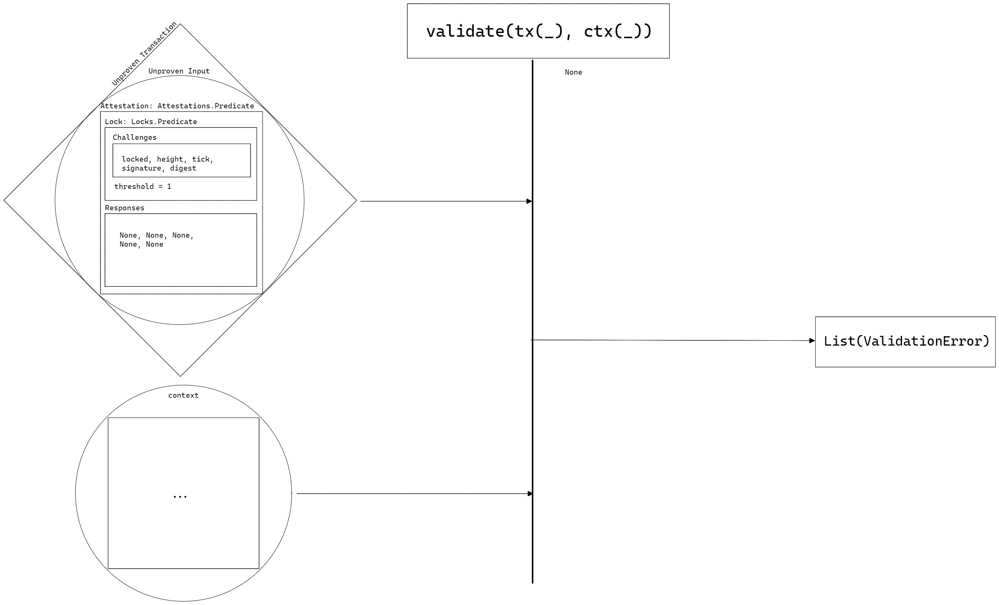

* **Given** `tx` is an IoTransaction with a single input with an attestation `Predicate` with 5 propositions in `challenges`
* **And** `responses` contains 5 `None` values
* **And** The predicate's threshold is 1
* **And** `ctx` is an arbitrary DynamicContext
* **When**
    ```
    validate(tx: IoTransaction, ctx: DynamicContext)
    ```
* **Then**
  A list containing the error [`CR003`](../../Common/Models/Errors.md#cr003-validationerror) is returned

```json
{
  "description": "Transaction Input with Attestation Type Predicate And None-Proofs",
  "inputs": {
    "unprovenTx": {
      "inputs": [
        {
          "knownIdentifier": {
            "network": 0,
            "ledger": 0,
            "index": 0,
            "id": {
              "tag": "iotx_32",
              "evidence": "real commitment that does exist"
            }
          },
          "attestation": {
            "lock": {
              "challenges": [
                {"locked": {}},
                {"signature": {"routine": "curve25519", "vk": "verificationKey_ijk"}},
                {"digest": {"routine": "blake2b256", "digest": "digest_ijk"}},
                {"heightRange": {"chain": "header", "min": 2, "max": 15}},
                {"tickRange": {"min": 2, "max": 15}}
              ], 
              "threshold": 6
            },
            "responses": [
              null,
              null,
              null,
              null,
              null
            ]
          },
          "value": {"quantity": 1, "blobs": []},
          "datum": {"references": [], "metadata": []},
          "opts": []
        }
      ],
      "outputs": [],
      "datum": {
        "schedule": {"min": 1, "max": 100, "timestamp": 99999},
        "references32": [],
        "references64": [],
        "metadata": []
      }
    },
    "ctx": {
      "signableBytes": "txBind",
      "currentTick": 10,
      "datums": {"header": {"height": 10}},
      "signingRoutines": {"curve25519": {"verify": "curve25519 verification"}},
      "hashingRoutines": {"blake2b256": {"verify": "blake2b256 verification"}}
    }
  },
  "outputs": ["CR003: ValidationError"]
}
```

#### Transaction Input with Attestation Type Predicate And DigitalSignature But Signature Verifier not in Context

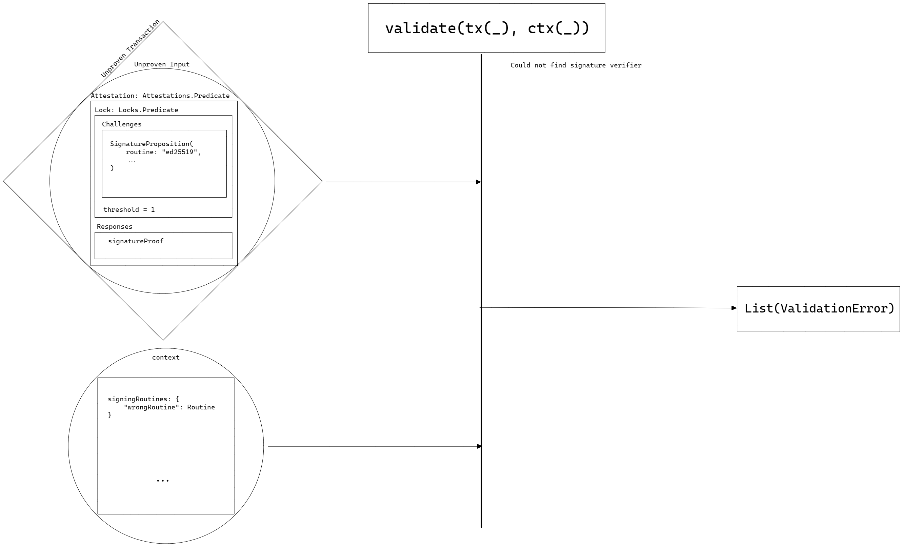

* **Given** `tx` is an IoTransaction with a single input with an attestation `Predicate` with a DigitalSignature proposition 
* **And** DigitalSignature proposition uses routine "curve25519"
* **And** `responses` contains a DigitalSignature proof
* **And** The predicate's threshold is 1
* **And** `ctx` is a DynamicContext whose `signingRoutines` does *not* contain "curve25519"
* **When**
    ```
    validate(tx: IoTransaction, ctx: DynamicContext)
    ```
* **Then**
  A list containing the error [`CR003`](../../Common/Models/Errors.md#cr003-validationerror) is returned

```json
{
  "description": "Transaction Input with Attestation Type Predicate And DigitalSignature But Signature Verifier not in Context",
  "inputs": {
    "unprovenTx": {
      "inputs": [
        {
          "knownIdentifier": {
            "network": 0,
            "ledger": 0,
            "index": 0,
            "id": {
              "tag": "iotx_32",
              "evidence": "real commitment that does exist"
            }
          },
          "attestation": {
            "lock": {
              "challenges": [
                {"signature": {"routine": "curve25519", "vk": "verificationKey_ijk"}}
              ], 
              "threshold": 1
            },
            "responses": [
              {"signature": {"transactionBind": "txBind", "witness": "witness_ijk"}}
            ]
          },
          "value": {"quantity": 1, "blobs": []},
          "datum": {"references": [], "metadata": []},
          "opts": []
        }
      ],
      "outputs": [],
      "datum": {
        "schedule": {"min": 1, "max": 100, "timestamp": 99999},
        "references32": [],
        "references64": [],
        "metadata": []
      }
    },
    "ctx": {
      "signableBytes": "txBind",
      "currentTick": 10,
      "datums": {"header": {"height": 10}},
      "signingRoutines": {"random": {"verify": "arbitrary verification"}},
      "hashingRoutines": {"blake2b256": {"verify": "blake2b256 verification"}}
    }
  },
  "outputs": ["CR003: ValidationError"]
}
```

#### Transaction Input with Attestation Type Predicate And DigitalSignature With Invalid Proof

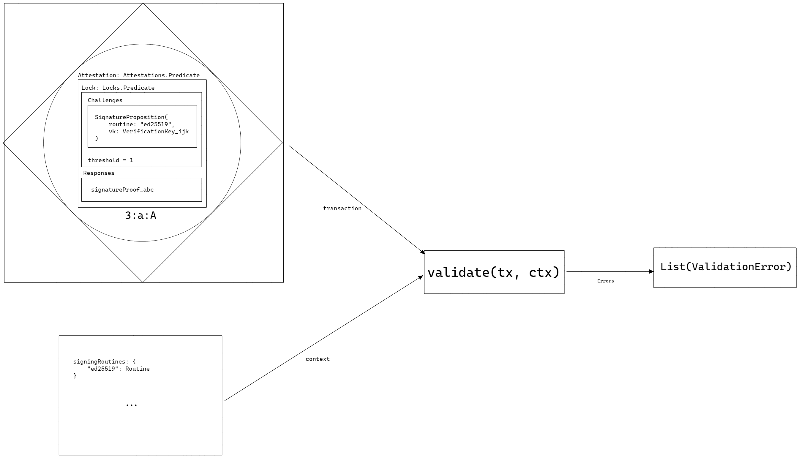

* **Given** `tx` is an IoTransaction with a single input with an attestation `Predicate` with a DigitalSignature proposition 
* **And** DigitalSignature proposition uses routine "curve25519"
* **And** `responses` contains a DigitalSignature proof that was created with a different key than the proposition
* **And** The predicate's threshold is 1
* **And** `ctx` is a DynamicContext whose `signingRoutines` contains "curve25519"
* **When**
    ```
    validate(tx: IoTransaction, ctx: DynamicContext)
    ```
* **Then**
  A list containing the error [`CR003`](../../Common/Models/Errors.md#cr003-validationerror) is returned

```json
{
  "description": "Transaction Input with Attestation Type Predicate And DigitalSignature With Invalid Proof",
  "inputs": {
    "unprovenTx": {
      "inputs": [
        {
          "knownIdentifier": {
            "network": 0,
            "ledger": 0,
            "index": 0,
            "id": {
              "tag": "iotx_32",
              "evidence": "real commitment that does exist"
            }
          },
          "attestation": {
            "lock": {
              "challenges": [
                {"signature": {"routine": "curve25519", "vk": "verificationKey_ijk"}}
              ], 
              "threshold": 1
            },
            "responses": [
              {"signature": {"transactionBind": "txBind", "witness": "witness_abc"}}
            ]
          },
          "value": {"quantity": 1, "blobs": []},
          "datum": {"references": [], "metadata": []},
          "opts": []
        }
      ],
      "outputs": [],
      "datum": {
        "schedule": {"min": 1, "max": 100, "timestamp": 99999},
        "references32": [],
        "references64": [],
        "metadata": []
      }
    },
    "ctx": {
      "signableBytes": "txBind",
      "currentTick": 10,
      "datums": {"header": {"height": 10}},
      "signingRoutines": {"curve25519": {"verify": "curve25519 verification"}},
      "hashingRoutines": {"blake2b256": {"verify": "blake2b256 verification"}}
    }
  },
  "outputs": ["CR003: ValidationError"]
}
```

#### Transaction Input with Attestation Type Predicate And DigitalSignature With Valid Proof

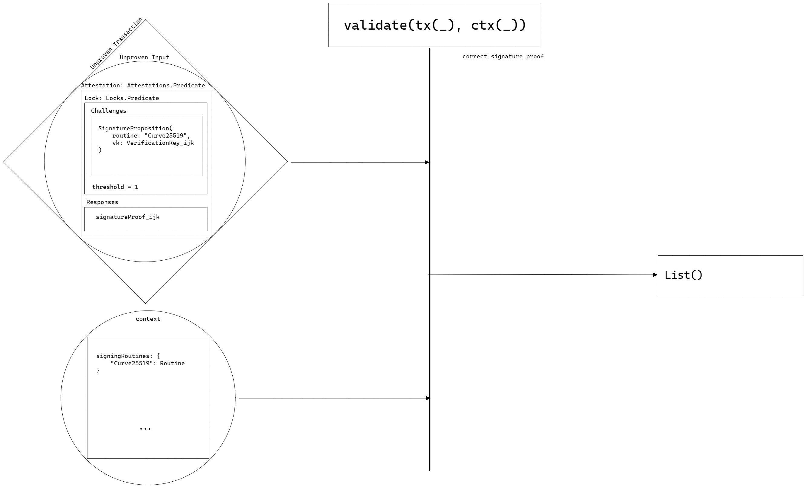

* **Given** `tx` is an IoTransaction with a single input with an attestation `Predicate` with a DigitalSignature proposition 
* **And** DigitalSignature proposition uses routine "curve25519"
* **And** `responses` contains a DigitalSignature proof that was created with the same key as the proposition
* **And** The predicate's threshold is 1
* **And** `ctx` is a DynamicContext whose `signingRoutines` contains "curve25519"
* **When**
    ```
    validate(tx: IoTransaction, ctx: DynamicContext)
    ```
* **Then**
  The transaction is valid thus an empty list is returned

```json
{
  "description": "Transaction Input with Attestation Type Predicate And DigitalSignature With Valid Proof",
  "inputs": {
    "unprovenTx": {
      "inputs": [
        {
          "knownIdentifier": {
            "network": 0,
            "ledger": 0,
            "index": 0,
            "id": {
              "tag": "iotx_32",
              "evidence": "real commitment that does exist"
            }
          },
          "attestation": {
            "lock": {
              "challenges": [
                {"signature": {"routine": "curve25519", "vk": "verificationKey_ijk"}}
              ], 
              "threshold": 1
            },
            "responses": [
              {"signature": {"transactionBind": "txBind", "witness": "witness_ijk"}}
            ]
          },
          "value": {"quantity": 1, "blobs": []},
          "datum": {"references": [], "metadata": []},
          "opts": []
        }
      ],
      "outputs": [],
      "datum": {
        "schedule": {"min": 1, "max": 100, "timestamp": 99999},
        "references32": [],
        "references64": [],
        "metadata": []
      }
    },
    "ctx": {
      "signableBytes": "txBind",
      "currentTick": 10,
      "datums": {"header": {"height": 10}},
      "signingRoutines": {"curve25519": {"verify": "curve25519 verification"}},
      "hashingRoutines": {"blake2b256": {"verify": "blake2b256 verification"}}
    }
  },
  "outputs": []
}
```

#### Transaction Input with Attestation Type Predicate And Digest But Digest Verifier not in Context

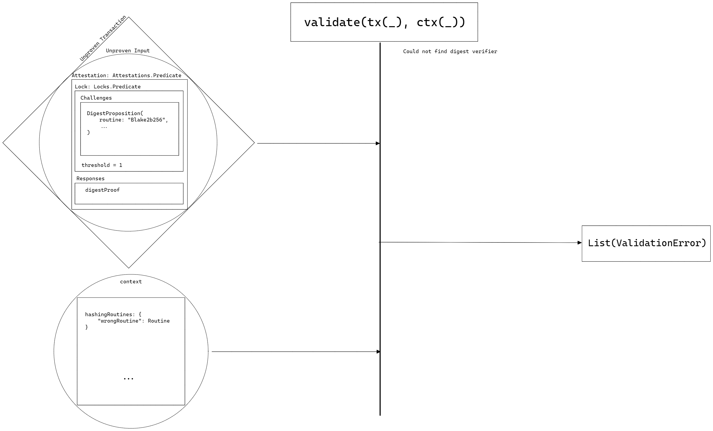

* **Given** `tx` is an IoTransaction with a single input with an attestation `Predicate` with a Digest proposition 
* **And** Digest proposition uses routine "blake2b256"
* **And** `responses` contains a Digest proof
* **And** The predicate's threshold is 1
* **And** `ctx` is a DynamicContext whose `hashingRoutines` does *not* contain "blake2b256"
* **When**
    ```
    validate(tx: IoTransaction, ctx: DynamicContext)
    ```
* **Then**
  A list containing the error [`CR003`](../../Common/Models/Errors.md#cr003-validationerror) is returned

```json
{
  "description": "Transaction Input with Attestation Type Predicate And Digest But Digest Verifier not in Context",
  "inputs": {
    "unprovenTx": {
      "inputs": [
        {
          "knownIdentifier": {
            "network": 0,
            "ledger": 0,
            "index": 0,
            "id": {
              "tag": "iotx_32",
              "evidence": "real commitment that does exist"
            }
          },
          "attestation": {
            "lock": {
              "challenges": [
                {"digest": {"routine": "blake2b256", "digest": "digest_ijk"}}
              ], 
              "threshold": 1
            },
            "responses": [
              {"digest": {"transactionBind": "txBind", "preimage": "preimage_ijk"}}
            ]
          },
          "value": {"quantity": 1, "blobs": []},
          "datum": {"references": [], "metadata": []},
          "opts": []
        }
      ],
      "outputs": [],
      "datum": {
        "schedule": {"min": 1, "max": 100, "timestamp": 99999},
        "references32": [],
        "references64": [],
        "metadata": []
      }
    },
    "ctx": {
      "signableBytes": "txBind",
      "currentTick": 10,
      "datums": {"header": {"height": 10}},
      "signingRoutines": {"curve25519": {"verify": "curve25519 verification"}},
      "hashingRoutines": {"random": {"verify": "arbitrary verification"}}
    }
  },
  "outputs": ["CR003: ValidationError"]
}
```

#### Transaction Input with Attestation Type Predicate And Digest With Invalid Proof


* **Given** `tx` is an IoTransaction with a single input with an attestation `Predicate` with a Digest proposition 
* **And** Digest proposition uses routine "blake2b256"
* **And** `responses` contains a Digest proof that contains a preimage that does *not* match the proposition
* **And** The predicate's threshold is 1
* **And** `ctx` is a DynamicContext whose `hashingRoutines` contains "blake2b256"
* **When**
    ```
    validate(tx: IoTransaction, ctx: DynamicContext)
    ```
* **Then**
  A list containing the error [`CR003`](../../Common/Models/Errors.md#cr003-validationerror) is returned

```json
{
  "description": "Transaction Input with Attestation Type Predicate And Digest With Invalid Proof",
  "inputs": {
    "unprovenTx": {
      "inputs": [
        {
          "knownIdentifier": {
            "network": 0,
            "ledger": 0,
            "index": 0,
            "id": {
              "tag": "iotx_32",
              "evidence": "real commitment that does exist"
            }
          },
          "attestation": {
            "lock": {
              "challenges": [
                {"digest": {"routine": "blake2b256", "digest": "digest_ijk"}}
              ], 
              "threshold": 1
            },
            "responses": [
              {"digest": {"transactionBind": "txBind", "preimage": "preimage_abc"}}
            ]
          },
          "value": {"quantity": 1, "blobs": []},
          "datum": {"references": [], "metadata": []},
          "opts": []
        }
      ],
      "outputs": [],
      "datum": {
        "schedule": {"min": 1, "max": 100, "timestamp": 99999},
        "references32": [],
        "references64": [],
        "metadata": []
      }
    },
    "ctx": {
      "signableBytes": "txBind",
      "currentTick": 10,
      "datums": {"header": {"height": 10}},
      "signingRoutines": {"curve25519": {"verify": "curve25519 verification"}},
      "hashingRoutines": {"blake2b256": {"verify": "blake2b256 verification"}}
    }
  },
  "outputs": ["CR003: ValidationError"]
}
```

#### Transaction Input with Attestation Type Predicate And Digest With Valid Proof

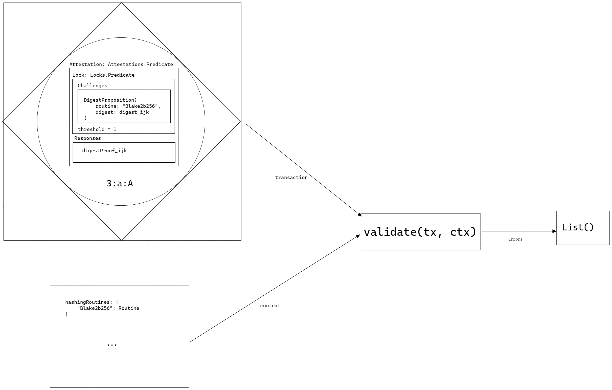

* **Given** `tx` is an IoTransaction with a single input with an attestation `Predicate` with a Digest proposition 
* **And** Digest proposition uses routine "blake2b256"
* **And** `responses` contains a Digest proof that contains the correct preimage
* **And** The predicate's threshold is 1
* **And** `ctx` is a DynamicContext whose `hashingRoutines` contains "blake2b256"
* **When**
    ```
    validate(tx: IoTransaction, ctx: DynamicContext)
    ```
* **Then**
  The transaction is valid thus an empty list is returned

```json
{
  "description": "Transaction Input with Attestation Type Predicate And Digest With Valid Proof",
  "inputs": {
    "unprovenTx": {
      "inputs": [
        {
          "knownIdentifier": {
            "network": 0,
            "ledger": 0,
            "index": 0,
            "id": {
              "tag": "iotx_32",
              "evidence": "real commitment that does exist"
            }
          },
          "attestation": {
            "lock": {
              "challenges": [
                {"digest": {"routine": "blake2b256", "digest": "digest_ijk"}}
              ], 
              "threshold": 1
            },
            "responses": [
              {"digest": {"transactionBind": "txBind", "preimage": "preimage_ijk"}}
            ]
          },
          "value": {"quantity": 1, "blobs": []},
          "datum": {"references": [], "metadata": []},
          "opts": []
        }
      ],
      "outputs": [],
      "datum": {
        "schedule": {"min": 1, "max": 100, "timestamp": 99999},
        "references32": [],
        "references64": [],
        "metadata": []
      }
    },
    "ctx": {
      "signableBytes": "txBind",
      "currentTick": 10,
      "datums": {"header": {"height": 10}},
      "signingRoutines": {"curve25519": {"verify": "curve25519 verification"}},
      "hashingRoutines": {"blake2b256": {"verify": "blake2b256 verification"}}
    }
  },
  "outputs": []
}
```

#### Transaction Input with Attestation Type Predicate And HeightRange But Height not in Context Datums

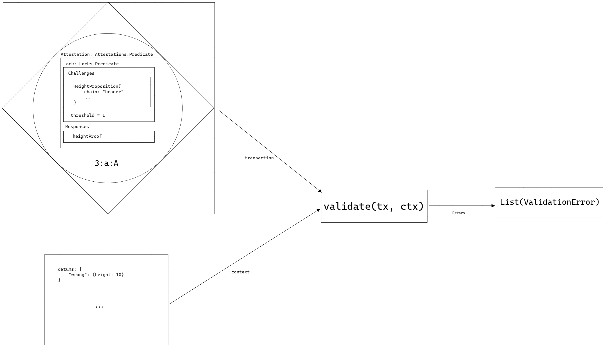

* **Given** `tx` is an IoTransaction with a single input with an attestation `Predicate` with a HeightRange proposition 
* **And** HeightRange proposition uses chain "header"
* **And** `responses` contains a HeightRange proof
* **And** The predicate's threshold is 1
* **And** `ctx` is a DynamicContext whose `datums` does *not* contain a height value for "header"
* **When**
    ```
    validate(tx: IoTransaction, ctx: DynamicContext)
    ```
* **Then**
  A list containing the error [`CR003`](../../Common/Models/Errors.md#cr003-validationerror) is returned

```json
{
  "description": "Transaction Input with Attestation Type Predicate And HeightRange But Height not in Context Datums",
  "inputs": {
    "unprovenTx": {
      "inputs": [
        {
          "knownIdentifier": {
            "network": 0,
            "ledger": 0,
            "index": 0,
            "id": {
              "tag": "iotx_32",
              "evidence": "real commitment that does exist"
            }
          },
          "attestation": {
            "lock": {
              "challenges": [
                {"heightRange": {"chain": "header", "min": 2, "max": 15}}
              ], 
              "threshold": 1
            },
            "responses": [
              {"heightRange": {"transactionBind": "txBind"}}
            ]
          },
          "value": {"quantity": 1, "blobs": []},
          "datum": {"references": [], "metadata": []},
          "opts": []
        }
      ],
      "outputs": [],
      "datum": {
        "schedule": {"min": 1, "max": 100, "timestamp": 99999},
        "references32": [],
        "references64": [],
        "metadata": []
      }
    },
    "ctx": {
      "signableBytes": "txBind",
      "currentTick": 10,
      "datums": {"era": {"height": 10}},
      "signingRoutines": {"curve25519": {"verify": "curve25519 verification"}},
      "hashingRoutines": {"blake2b256": {"verify": "blake2b256 verification"}}
    }
  },
  "outputs": ["CR003: ValidationError"]
}
```

#### Transaction Input with Attestation Type Predicate And HeightRange But not Satisfied

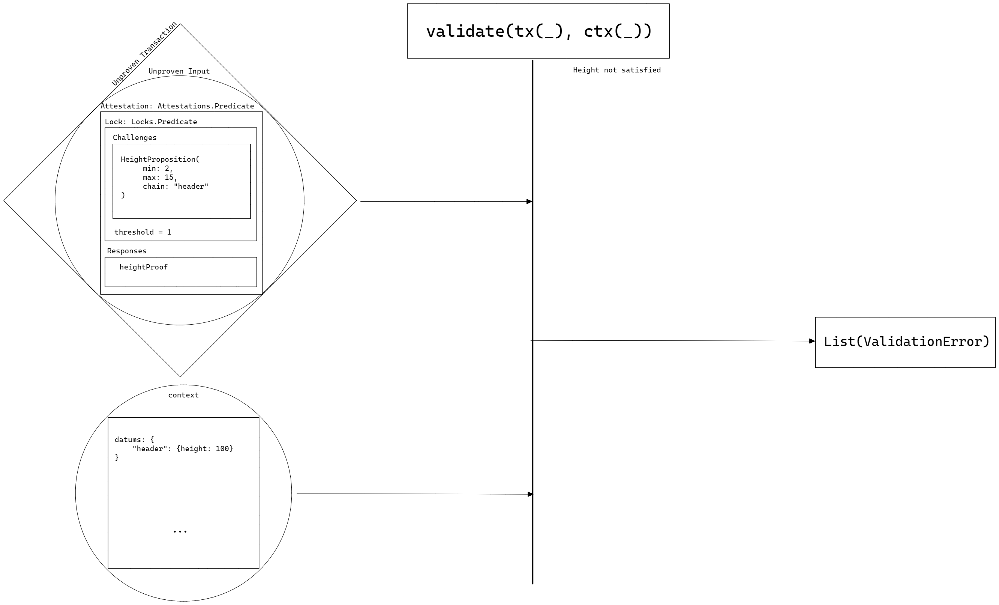

* **Given** `tx` is an IoTransaction with a single input with an attestation `Predicate` with a HeightRange proposition 
* **And** HeightRange proposition uses chain "header", min: 2, and max: 15
* **And** `responses` contains a HeightRange proof
* **And** The predicate's threshold is 1
* **And** `ctx` is a DynamicContext whose `datums` contains the height value 100 for "header"
* **When**
    ```
    validate(tx: IoTransaction, ctx: DynamicContext)
    ```
* **Then**
  A list containing the error [`CR003`](../../Common/Models/Errors.md#cr003-validationerror) is returned

```json
{
  "description": "Transaction Input with Attestation Type Predicate And HeightRange But not Satisfied",
  "inputs": {
    "unprovenTx": {
      "inputs": [
        {
          "knownIdentifier": {
            "network": 0,
            "ledger": 0,
            "index": 0,
            "id": {
              "tag": "iotx_32",
              "evidence": "real commitment that does exist"
            }
          },
          "attestation": {
            "lock": {
              "challenges": [
                {"heightRange": {"chain": "header", "min": 2, "max": 15}}
              ], 
              "threshold": 1
            },
            "responses": [
              {"heightRange": {"transactionBind": "txBind"}}
            ]
          },
          "value": {"quantity": 1, "blobs": []},
          "datum": {"references": [], "metadata": []},
          "opts": []
        }
      ],
      "outputs": [],
      "datum": {
        "schedule": {"min": 1, "max": 100, "timestamp": 99999},
        "references32": [],
        "references64": [],
        "metadata": []
      }
    },
    "ctx": {
      "signableBytes": "txBind",
      "currentTick": 10,
      "datums": {"header": {"height": 100}},
      "signingRoutines": {"curve25519": {"verify": "curve25519 verification"}},
      "hashingRoutines": {"blake2b256": {"verify": "blake2b256 verification"}}
    }
  },
  "outputs": ["CR003: ValidationError"]
}
```

#### Transaction Input with Attestation Type Predicate And HeightRange Satisfied

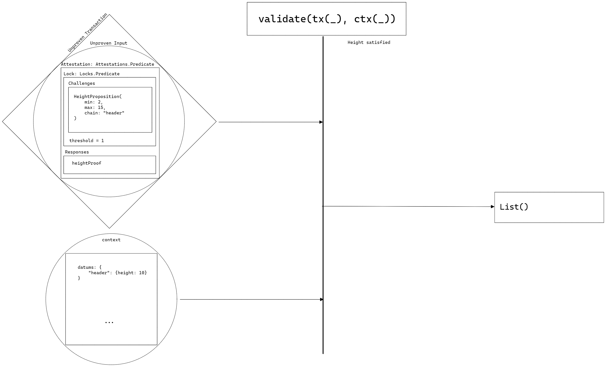

* **Given** `tx` is an IoTransaction with a single input with an attestation `Predicate` with a HeightRange proposition 
* **And** HeightRange proposition uses chain "header", min: 2, and max: 15
* **And** `responses` contains a HeightRange proof
* **And** The predicate's threshold is 1
* **And** `ctx` is a DynamicContext whose `datums` contains the height value 10 for "header"
* **When**
    ```
    validate(tx: IoTransaction, ctx: DynamicContext)
    ```
* **Then**
  The transaction is valid thus an empty list is returned

```json
{
  "description": "Transaction Input with Attestation Type Predicate And HeightRange Satisfied",
  "inputs": {
    "unprovenTx": {
      "inputs": [
        {
          "knownIdentifier": {
            "network": 0,
            "ledger": 0,
            "index": 0,
            "id": {
              "tag": "iotx_32",
              "evidence": "real commitment that does exist"
            }
          },
          "attestation": {
            "lock": {
              "challenges": [
                {"heightRange": {"chain": "header", "min": 2, "max": 15}}
              ], 
              "threshold": 1
            },
            "responses": [
              {"heightRange": {"transactionBind": "txBind"}}
            ]
          },
          "value": {"quantity": 1, "blobs": []},
          "datum": {"references": [], "metadata": []},
          "opts": []
        }
      ],
      "outputs": [],
      "datum": {
        "schedule": {"min": 1, "max": 100, "timestamp": 99999},
        "references32": [],
        "references64": [],
        "metadata": []
      }
    },
    "ctx": {
      "signableBytes": "txBind",
      "currentTick": 10,
      "datums": {"header": {"height": 10}},
      "signingRoutines": {"curve25519": {"verify": "curve25519 verification"}},
      "hashingRoutines": {"blake2b256": {"verify": "blake2b256 verification"}}
    }
  },
  "outputs": []
}
```

#### Transaction Input with Attestation Type Predicate And TickRange But not Satisfied

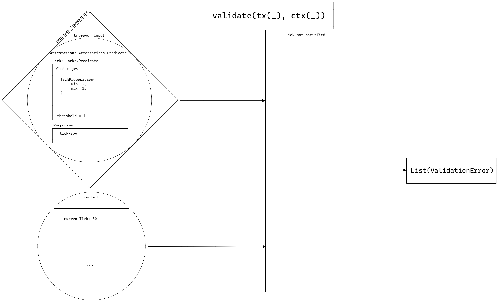

* **Given** `tx` is an IoTransaction with a single input with an attestation `Predicate` with a TickRange proposition 
* **And** TickRange proposition uses min: 2, and max: 15
* **And** `responses` contains a TickRange proof
* **And** The predicate's threshold is 1
* **And** `ctx` is a DynamicContext value for `currentTick` is 50
* **When**
    ```
    validate(tx: IoTransaction, ctx: DynamicContext)
    ```
* **Then**
  A list containing the error [`CR003`](../../Common/Models/Errors.md#cr003-validationerror) is returned

```json
{
  "description": "Transaction Input with Attestation Type Predicate And TickRange But not Satisfied",
  "inputs": {
    "unprovenTx": {
      "inputs": [
        {
          "knownIdentifier": {
            "network": 0,
            "ledger": 0,
            "index": 0,
            "id": {
              "tag": "iotx_32",
              "evidence": "real commitment that does exist"
            }
          },
          "attestation": {
            "lock": {
              "challenges": [
                {"heightRange": {"chain": "header", "min": 2, "max": 15}}
              ], 
              "threshold": 1
            },
            "responses": [
              {"heightRange": {"transactionBind": "txBind"}}
            ]
          },
          "value": {"quantity": 1, "blobs": []},
          "datum": {"references": [], "metadata": []},
          "opts": []
        }
      ],
      "outputs": [],
      "datum": {
        "schedule": {"min": 1, "max": 100, "timestamp": 99999},
        "references32": [],
        "references64": [],
        "metadata": []
      }
    },
    "ctx": {
      "signableBytes": "txBind",
      "currentTick": 50,
      "datums": {"header": {"height": 10}},
      "signingRoutines": {"curve25519": {"verify": "curve25519 verification"}},
      "hashingRoutines": {"blake2b256": {"verify": "blake2b256 verification"}}
    }
  },
  "outputs": ["CR003: ValidationError"]
}
```

#### Transaction Input with Attestation Type Predicate And TickRange Satisfied

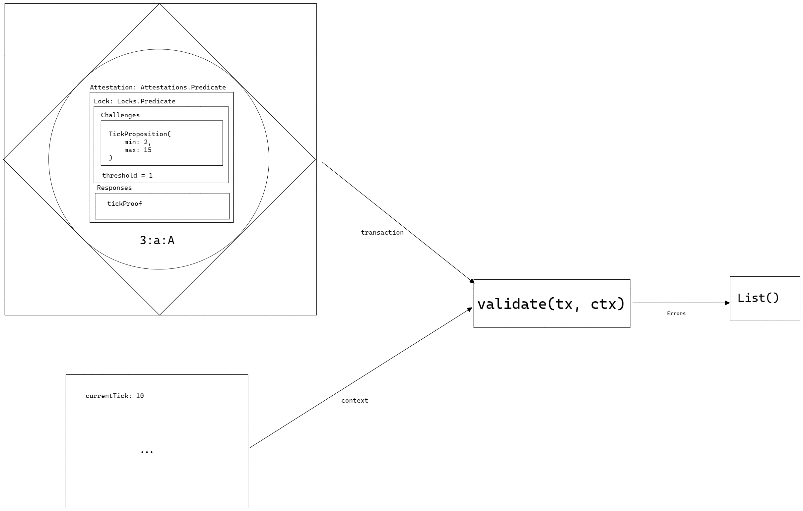

* **Given** `tx` is an IoTransaction with a single input with an attestation `Predicate` with a TickRange proposition 
* **And** TickRange proposition uses min: 2, and max: 15
* **And** `responses` contains a TickRange proof
* **And** The predicate's threshold is 1
* **And** `ctx` is a DynamicContext value for `currentTick` is 10
* **When**
    ```
    validate(tx: IoTransaction, ctx: DynamicContext)
    ```
* **Then**
  The transaction is valid thus an empty list is returned

```json
{
  "description": "Transaction Input with Attestation Type Predicate And TickRange Satisfied",
  "inputs": {
    "unprovenTx": {
      "inputs": [
        {
          "knownIdentifier": {
            "network": 0,
            "ledger": 0,
            "index": 0,
            "id": {
              "tag": "iotx_32",
              "evidence": "real commitment that does exist"
            }
          },
          "attestation": {
            "lock": {
              "challenges": [
                {"heightRange": {"chain": "header", "min": 2, "max": 15}}
              ], 
              "threshold": 1
            },
            "responses": [
              {"heightRange": {"transactionBind": "txBind"}}
            ]
          },
          "value": {"quantity": 1, "blobs": []},
          "datum": {"references": [], "metadata": []},
          "opts": []
        }
      ],
      "outputs": [],
      "datum": {
        "schedule": {"min": 1, "max": 100, "timestamp": 99999},
        "references32": [],
        "references64": [],
        "metadata": []
      }
    },
    "ctx": {
      "signableBytes": "txBind",
      "currentTick": 10,
      "datums": {"header": {"height": 10}},
      "signingRoutines": {"curve25519": {"verify": "curve25519 verification"}},
      "hashingRoutines": {"blake2b256": {"verify": "blake2b256 verification"}}
    }
  },
  "outputs": []
}
```

### Test Vectors

```json
[
  {
    "description": "Transaction Input with Attestation Type Image32/64",
    "inputs": {
      "tx": {
        "inputs": [
          {
            "knownIdentifier": {
              "network": 0,
              "ledger": 0,
              "index": 0,
              "id": {
                "tag": "iotx_32",
                "evidence": "real commitment that does exist"
              }
            },
            "attestation": {
              "lock": {"leaves": [], "threshold": 0},
              "known": [],
              "responses": []
            },
            "value": {"quantity": 1, "blobs": []},
            "datum": {"references": [], "metadata": []},
            "opts": []
          }
        ],
        "outputs": [],
        "datum": {
          "schedule": {"min": 1, "max": 100, "timestamp": 99999},
          "references32": [],
          "references64": [],
          "metadata": []
        }
      },
      "ctx": {
        "signableBytes": "xxxx",
        "currentTick": 10,
        "datums": {"header": {"height": 10}},
        "signingRoutines": {"curve25519": {"verify": "curve25519 verification"}},
        "hashingRoutines": {"blake2b256": {"verify": "blake2b256 verification"}}
      }
    },
    "outputs": "TBD"
  },
  {
    "description": "Transaction Input with Attestation Type Commitment32/64",
    "inputs": {
      "tx": {
        "inputs": [
          {
            "knownIdentifier": {
              "network": 0,
              "ledger": 0,
              "index": 0,
              "id": {
                "tag": "iotx_32",
                "evidence": "real commitment that does exist"
              }
            },
            "attestation": {
              "lock": {"root": "", "threshold": 0},
              "known": [],
              "responses": []
            },
            "value": {"quantity": 1, "blobs": []},
            "datum": {"references": [], "metadata": []},
            "opts": []
          }
        ],
        "outputs": [],
        "datum": {
          "schedule": {"min": 1, "max": 100, "timestamp": 99999},
          "references32": [],
          "references64": [],
          "metadata": []
        }
      },
      "ctx": {
        "signableBytes": "xxxx",
        "currentTick": 10,
        "datums": {"header": {"height": 10}},
        "signingRoutines": {"curve25519": {"verify": "curve25519 verification"}},
        "hashingRoutines": {"blake2b256": {"verify": "blake2b256 verification"}}
      }
    },
    "outputs": "TBD"
  },
  {
    "description": "Transaction Input with Proofs Whose TransactionBind Does Not Match the Context SignableBytes",
    "inputs": {
      "unprovenTx": {
        "inputs": [
          {
            "knownIdentifier": {
              "network": 0,
              "ledger": 0,
              "index": 0,
              "id": {
                "tag": "iotx_32",
                "evidence": "real commitment that does exist"
              }
            },
            "attestation": {
              "lock": {
                "challenges": [
                  {"locked": {}},
                  {"signature": {"routine": "curve25519", "vk": "verificationKey_ijk"}},
                  {"digest": {"routine": "blake2b256", "digest": "digest_ijk"}},
                  {"heightRange": {"chain": "header", "min": 2, "max": 15}},
                  {"tickRange": {"min": 2, "max": 15}}
                ], 
                "threshold": 1
              },
              "responses": [
                {"locked": {}},
                {"signature": {"transactionBind": "txBind", "witness": "witness_ijk"}},
                {"digest": {"transactionBind": "txBind", "preimage": "preimage_ijk"}},
                {"heightRange": {"transactionBind": "txBind"}},
                {"tickRange": {"transactionBind": "txBind"}}
              ]
            },
            "value": {"quantity": 1, "blobs": []},
            "datum": {"references": [], "metadata": []},
            "opts": []
          }
        ],
        "outputs": [],
        "datum": {
          "schedule": {"min": 1, "max": 100, "timestamp": 99999},
          "references32": [],
          "references64": [],
          "metadata": []
        }
      },
      "ctx": {
        "signableBytes": "wrong signable bytes",
        "currentTick": 10,
        "datums": {"header": {"height": 10}},
        "signingRoutines": {"curve25519": {"verify": "curve25519 verification"}},
        "hashingRoutines": {"blake2b256": {"verify": "blake2b256 verification"}}
      }
    },
    "outputs": ["CR003: ValidationError"]
  },
  {
    "description": "Transaction Input with Attestation Type Predicate Whose Threshold is Unobtainable",
    "inputs": {
      "unprovenTx": {
        "inputs": [
          {
            "knownIdentifier": {
              "network": 0,
              "ledger": 0,
              "index": 0,
              "id": {
                "tag": "iotx_32",
                "evidence": "real commitment that does exist"
              }
            },
            "attestation": {
              "lock": {
                "challenges": [
                  {"locked": {}},
                  {"signature": {"routine": "curve25519", "vk": "verificationKey_ijk"}},
                  {"digest": {"routine": "blake2b256", "digest": "digest_ijk"}},
                  {"heightRange": {"chain": "header", "min": 2, "max": 15}},
                  {"tickRange": {"min": 2, "max": 15}}
                ], 
                "threshold": 6
              },
              "responses": [
                {"locked": {}},
                {"signature": {"transactionBind": "txBind", "witness": "witness_ijk"}},
                {"digest": {"transactionBind": "txBind", "preimage": "preimage_ijk"}},
                {"heightRange": {"transactionBind": "txBind"}},
                {"tickRange": {"transactionBind": "txBind"}}
              ]
            },
            "value": {"quantity": 1, "blobs": []},
            "datum": {"references": [], "metadata": []},
            "opts": []
          }
        ],
        "outputs": [],
        "datum": {
          "schedule": {"min": 1, "max": 100, "timestamp": 99999},
          "references32": [],
          "references64": [],
          "metadata": []
        }
      },
      "ctx": {
        "signableBytes": "txBind",
        "currentTick": 10,
        "datums": {"header": {"height": 10}},
        "signingRoutines": {"curve25519": {"verify": "curve25519 verification"}},
        "hashingRoutines": {"blake2b256": {"verify": "blake2b256 verification"}}
      }
    },
    "outputs": ["CR003: ValidationError"]
  },
  {
    "description": "Transaction Input with Attestation Type Predicate And Locked Challenge",
    "inputs": {
      "unprovenTx": {
        "inputs": [
          {
            "knownIdentifier": {
              "network": 0,
              "ledger": 0,
              "index": 0,
              "id": {
                "tag": "iotx_32",
                "evidence": "real commitment that does exist"
              }
            },
            "attestation": {
              "lock": {
                "challenges": [
                  {"locked": {}}
                ], 
                "threshold": 1
              },
              "responses": [
                {"locked": {}}
              ]
            },
            "value": {"quantity": 1, "blobs": []},
            "datum": {"references": [], "metadata": []},
            "opts": []
          }
        ],
        "outputs": [],
        "datum": {
          "schedule": {"min": 1, "max": 100, "timestamp": 99999},
          "references32": [],
          "references64": [],
          "metadata": []
        }
      },
      "ctx": {
        "signableBytes": "txBind",
        "currentTick": 10,
        "datums": {"header": {"height": 10}},
        "signingRoutines": {"curve25519": {"verify": "curve25519 verification"}},
        "hashingRoutines": {"blake2b256": {"verify": "blake2b256 verification"}}
      }
    },
    "outputs": ["CR003: ValidationError"]
  },
  {
    "description": "Transaction Input with Attestation Type Predicate And None-Proofs",
    "inputs": {
      "unprovenTx": {
        "inputs": [
          {
            "knownIdentifier": {
              "network": 0,
              "ledger": 0,
              "index": 0,
              "id": {
                "tag": "iotx_32",
                "evidence": "real commitment that does exist"
              }
            },
            "attestation": {
              "lock": {
                "challenges": [
                  {"locked": {}},
                  {"signature": {"routine": "curve25519", "vk": "verificationKey_ijk"}},
                  {"digest": {"routine": "blake2b256", "digest": "digest_ijk"}},
                  {"heightRange": {"chain": "header", "min": 2, "max": 15}},
                  {"tickRange": {"min": 2, "max": 15}}
                ], 
                "threshold": 6
              },
              "responses": [
                null,
                null,
                null,
                null,
                null
              ]
            },
            "value": {"quantity": 1, "blobs": []},
            "datum": {"references": [], "metadata": []},
            "opts": []
          }
        ],
        "outputs": [],
        "datum": {
          "schedule": {"min": 1, "max": 100, "timestamp": 99999},
          "references32": [],
          "references64": [],
          "metadata": []
        }
      },
      "ctx": {
        "signableBytes": "txBind",
        "currentTick": 10,
        "datums": {"header": {"height": 10}},
        "signingRoutines": {"curve25519": {"verify": "curve25519 verification"}},
        "hashingRoutines": {"blake2b256": {"verify": "blake2b256 verification"}}
      }
    },
    "outputs": ["CR003: ValidationError"]
  },
  {
    "description": "Transaction Input with Attestation Type Predicate And DigitalSignature But Signature Verifier not in Context",
    "inputs": {
      "unprovenTx": {
        "inputs": [
          {
            "knownIdentifier": {
              "network": 0,
              "ledger": 0,
              "index": 0,
              "id": {
                "tag": "iotx_32",
                "evidence": "real commitment that does exist"
              }
            },
            "attestation": {
              "lock": {
                "challenges": [
                  {"signature": {"routine": "curve25519", "vk": "verificationKey_ijk"}}
                ], 
                "threshold": 1
              },
              "responses": [
                {"signature": {"transactionBind": "txBind", "witness": "witness_ijk"}}
              ]
            },
            "value": {"quantity": 1, "blobs": []},
            "datum": {"references": [], "metadata": []},
            "opts": []
          }
        ],
        "outputs": [],
        "datum": {
          "schedule": {"min": 1, "max": 100, "timestamp": 99999},
          "references32": [],
          "references64": [],
          "metadata": []
        }
      },
      "ctx": {
        "signableBytes": "txBind",
        "currentTick": 10,
        "datums": {"header": {"height": 10}},
        "signingRoutines": {"random": {"verify": "arbitrary verification"}},
        "hashingRoutines": {"blake2b256": {"verify": "blake2b256 verification"}}
      }
    },
    "outputs": ["CR003: ValidationError"]
  },
  {
    "description": "Transaction Input with Attestation Type Predicate And DigitalSignature With Invalid Proof",
    "inputs": {
      "unprovenTx": {
        "inputs": [
          {
            "knownIdentifier": {
              "network": 0,
              "ledger": 0,
              "index": 0,
              "id": {
                "tag": "iotx_32",
                "evidence": "real commitment that does exist"
              }
            },
            "attestation": {
              "lock": {
                "challenges": [
                  {"signature": {"routine": "curve25519", "vk": "verificationKey_ijk"}}
                ], 
                "threshold": 1
              },
              "responses": [
                {"signature": {"transactionBind": "txBind", "witness": "witness_abc"}}
              ]
            },
            "value": {"quantity": 1, "blobs": []},
            "datum": {"references": [], "metadata": []},
            "opts": []
          }
        ],
        "outputs": [],
        "datum": {
          "schedule": {"min": 1, "max": 100, "timestamp": 99999},
          "references32": [],
          "references64": [],
          "metadata": []
        }
      },
      "ctx": {
        "signableBytes": "txBind",
        "currentTick": 10,
        "datums": {"header": {"height": 10}},
        "signingRoutines": {"curve25519": {"verify": "curve25519 verification"}},
        "hashingRoutines": {"blake2b256": {"verify": "blake2b256 verification"}}
      }
    },
    "outputs": ["CR003: ValidationError"]
  },
  {
    "description": "Transaction Input with Attestation Type Predicate And DigitalSignature With Valid Proof",
    "inputs": {
      "unprovenTx": {
        "inputs": [
          {
            "knownIdentifier": {
              "network": 0,
              "ledger": 0,
              "index": 0,
              "id": {
                "tag": "iotx_32",
                "evidence": "real commitment that does exist"
              }
            },
            "attestation": {
              "lock": {
                "challenges": [
                  {"signature": {"routine": "curve25519", "vk": "verificationKey_ijk"}}
                ], 
                "threshold": 1
              },
              "responses": [
                {"signature": {"transactionBind": "txBind", "witness": "witness_ijk"}}
              ]
            },
            "value": {"quantity": 1, "blobs": []},
            "datum": {"references": [], "metadata": []},
            "opts": []
          }
        ],
        "outputs": [],
        "datum": {
          "schedule": {"min": 1, "max": 100, "timestamp": 99999},
          "references32": [],
          "references64": [],
          "metadata": []
        }
      },
      "ctx": {
        "signableBytes": "txBind",
        "currentTick": 10,
        "datums": {"header": {"height": 10}},
        "signingRoutines": {"curve25519": {"verify": "curve25519 verification"}},
        "hashingRoutines": {"blake2b256": {"verify": "blake2b256 verification"}}
      }
    },
    "outputs": []
  },
  {
    "description": "Transaction Input with Attestation Type Predicate And Digest But Digest Verifier not in Context",
    "inputs": {
      "unprovenTx": {
        "inputs": [
          {
            "knownIdentifier": {
              "network": 0,
              "ledger": 0,
              "index": 0,
              "id": {
                "tag": "iotx_32",
                "evidence": "real commitment that does exist"
              }
            },
            "attestation": {
              "lock": {
                "challenges": [
                  {"digest": {"routine": "blake2b256", "digest": "digest_ijk"}}
                ], 
                "threshold": 1
              },
              "responses": [
                {"digest": {"transactionBind": "txBind", "preimage": "preimage_ijk"}}
              ]
            },
            "value": {"quantity": 1, "blobs": []},
            "datum": {"references": [], "metadata": []},
            "opts": []
          }
        ],
        "outputs": [],
        "datum": {
          "schedule": {"min": 1, "max": 100, "timestamp": 99999},
          "references32": [],
          "references64": [],
          "metadata": []
        }
      },
      "ctx": {
        "signableBytes": "txBind",
        "currentTick": 10,
        "datums": {"header": {"height": 10}},
        "signingRoutines": {"curve25519": {"verify": "curve25519 verification"}},
        "hashingRoutines": {"random": {"verify": "arbitrary verification"}}
      }
    },
    "outputs": ["CR003: ValidationError"]
  },
  {
    "description": "Transaction Input with Attestation Type Predicate And Digest With Invalid Proof",
    "inputs": {
      "unprovenTx": {
        "inputs": [
          {
            "knownIdentifier": {
              "network": 0,
              "ledger": 0,
              "index": 0,
              "id": {
                "tag": "iotx_32",
                "evidence": "real commitment that does exist"
              }
            },
            "attestation": {
              "lock": {
                "challenges": [
                  {"digest": {"routine": "blake2b256", "digest": "digest_ijk"}}
                ], 
                "threshold": 1
              },
              "responses": [
                {"digest": {"transactionBind": "txBind", "preimage": "preimage_abc"}}
              ]
            },
            "value": {"quantity": 1, "blobs": []},
            "datum": {"references": [], "metadata": []},
            "opts": []
          }
        ],
        "outputs": [],
        "datum": {
          "schedule": {"min": 1, "max": 100, "timestamp": 99999},
          "references32": [],
          "references64": [],
          "metadata": []
        }
      },
      "ctx": {
        "signableBytes": "txBind",
        "currentTick": 10,
        "datums": {"header": {"height": 10}},
        "signingRoutines": {"curve25519": {"verify": "curve25519 verification"}},
        "hashingRoutines": {"blake2b256": {"verify": "blake2b256 verification"}}
      }
    },
    "outputs": ["CR003: ValidationError"]
  },
  {
    "description": "Transaction Input with Attestation Type Predicate And Digest With Valid Proof",
    "inputs": {
      "unprovenTx": {
        "inputs": [
          {
            "knownIdentifier": {
              "network": 0,
              "ledger": 0,
              "index": 0,
              "id": {
                "tag": "iotx_32",
                "evidence": "real commitment that does exist"
              }
            },
            "attestation": {
              "lock": {
                "challenges": [
                  {"digest": {"routine": "blake2b256", "digest": "digest_ijk"}}
                ], 
                "threshold": 1
              },
              "responses": [
                {"digest": {"transactionBind": "txBind", "preimage": "preimage_ijk"}}
              ]
            },
            "value": {"quantity": 1, "blobs": []},
            "datum": {"references": [], "metadata": []},
            "opts": []
          }
        ],
        "outputs": [],
        "datum": {
          "schedule": {"min": 1, "max": 100, "timestamp": 99999},
          "references32": [],
          "references64": [],
          "metadata": []
        }
      },
      "ctx": {
        "signableBytes": "txBind",
        "currentTick": 10,
        "datums": {"header": {"height": 10}},
        "signingRoutines": {"curve25519": {"verify": "curve25519 verification"}},
        "hashingRoutines": {"blake2b256": {"verify": "blake2b256 verification"}}
      }
    },
    "outputs": []
  },
  {
    "description": "Transaction Input with Attestation Type Predicate And HeightRange But Height not in Context Datums",
    "inputs": {
      "unprovenTx": {
        "inputs": [
          {
            "knownIdentifier": {
              "network": 0,
              "ledger": 0,
              "index": 0,
              "id": {
                "tag": "iotx_32",
                "evidence": "real commitment that does exist"
              }
            },
            "attestation": {
              "lock": {
                "challenges": [
                  {"heightRange": {"chain": "header", "min": 2, "max": 15}}
                ], 
                "threshold": 1
              },
              "responses": [
                {"heightRange": {"transactionBind": "txBind"}}
              ]
            },
            "value": {"quantity": 1, "blobs": []},
            "datum": {"references": [], "metadata": []},
            "opts": []
          }
        ],
        "outputs": [],
        "datum": {
          "schedule": {"min": 1, "max": 100, "timestamp": 99999},
          "references32": [],
          "references64": [],
          "metadata": []
        }
      },
      "ctx": {
        "signableBytes": "txBind",
        "currentTick": 10,
        "datums": {"era": {"height": 10}},
        "signingRoutines": {"curve25519": {"verify": "curve25519 verification"}},
        "hashingRoutines": {"blake2b256": {"verify": "blake2b256 verification"}}
      }
    },
    "outputs": ["CR003: ValidationError"]
  },
  {
    "description": "Transaction Input with Attestation Type Predicate And HeightRange But not Satisfied",
    "inputs": {
      "unprovenTx": {
        "inputs": [
          {
            "knownIdentifier": {
              "network": 0,
              "ledger": 0,
              "index": 0,
              "id": {
                "tag": "iotx_32",
                "evidence": "real commitment that does exist"
              }
            },
            "attestation": {
              "lock": {
                "challenges": [
                  {"heightRange": {"chain": "header", "min": 2, "max": 15}}
                ], 
                "threshold": 1
              },
              "responses": [
                {"heightRange": {"transactionBind": "txBind"}}
              ]
            },
            "value": {"quantity": 1, "blobs": []},
            "datum": {"references": [], "metadata": []},
            "opts": []
          }
        ],
        "outputs": [],
        "datum": {
          "schedule": {"min": 1, "max": 100, "timestamp": 99999},
          "references32": [],
          "references64": [],
          "metadata": []
        }
      },
      "ctx": {
        "signableBytes": "txBind",
        "currentTick": 10,
        "datums": {"header": {"height": 100}},
        "signingRoutines": {"curve25519": {"verify": "curve25519 verification"}},
        "hashingRoutines": {"blake2b256": {"verify": "blake2b256 verification"}}
      }
    },
    "outputs": ["CR003: ValidationError"]
  },
  {
    "description": "Transaction Input with Attestation Type Predicate And HeightRange Satisfied",
    "inputs": {
      "unprovenTx": {
        "inputs": [
          {
            "knownIdentifier": {
              "network": 0,
              "ledger": 0,
              "index": 0,
              "id": {
                "tag": "iotx_32",
                "evidence": "real commitment that does exist"
              }
            },
            "attestation": {
              "lock": {
                "challenges": [
                  {"heightRange": {"chain": "header", "min": 2, "max": 15}}
                ], 
                "threshold": 1
              },
              "responses": [
                {"heightRange": {"transactionBind": "txBind"}}
              ]
            },
            "value": {"quantity": 1, "blobs": []},
            "datum": {"references": [], "metadata": []},
            "opts": []
          }
        ],
        "outputs": [],
        "datum": {
          "schedule": {"min": 1, "max": 100, "timestamp": 99999},
          "references32": [],
          "references64": [],
          "metadata": []
        }
      },
      "ctx": {
        "signableBytes": "txBind",
        "currentTick": 10,
        "datums": {"header": {"height": 10}},
        "signingRoutines": {"curve25519": {"verify": "curve25519 verification"}},
        "hashingRoutines": {"blake2b256": {"verify": "blake2b256 verification"}}
      }
    },
    "outputs": []
  },
  {
    "description": "Transaction Input with Attestation Type Predicate And TickRange But not Satisfied",
    "inputs": {
      "unprovenTx": {
        "inputs": [
          {
            "knownIdentifier": {
              "network": 0,
              "ledger": 0,
              "index": 0,
              "id": {
                "tag": "iotx_32",
                "evidence": "real commitment that does exist"
              }
            },
            "attestation": {
              "lock": {
                "challenges": [
                  {"heightRange": {"chain": "header", "min": 2, "max": 15}}
                ], 
                "threshold": 1
              },
              "responses": [
                {"heightRange": {"transactionBind": "txBind"}}
              ]
            },
            "value": {"quantity": 1, "blobs": []},
            "datum": {"references": [], "metadata": []},
            "opts": []
          }
        ],
        "outputs": [],
        "datum": {
          "schedule": {"min": 1, "max": 100, "timestamp": 99999},
          "references32": [],
          "references64": [],
          "metadata": []
        }
      },
      "ctx": {
        "signableBytes": "txBind",
        "currentTick": 50,
        "datums": {"header": {"height": 10}},
        "signingRoutines": {"curve25519": {"verify": "curve25519 verification"}},
        "hashingRoutines": {"blake2b256": {"verify": "blake2b256 verification"}}
      }
    },
    "outputs": ["CR003: ValidationError"]
  },
  {
    "description": "Transaction Input with Attestation Type Predicate And TickRange Satisfied",
    "inputs": {
      "unprovenTx": {
        "inputs": [
          {
            "knownIdentifier": {
              "network": 0,
              "ledger": 0,
              "index": 0,
              "id": {
                "tag": "iotx_32",
                "evidence": "real commitment that does exist"
              }
            },
            "attestation": {
              "lock": {
                "challenges": [
                  {"heightRange": {"chain": "header", "min": 2, "max": 15}}
                ], 
                "threshold": 1
              },
              "responses": [
                {"heightRange": {"transactionBind": "txBind"}}
              ]
            },
            "value": {"quantity": 1, "blobs": []},
            "datum": {"references": [], "metadata": []},
            "opts": []
          }
        ],
        "outputs": [],
        "datum": {
          "schedule": {"min": 1, "max": 100, "timestamp": 99999},
          "references32": [],
          "references64": [],
          "metadata": []
        }
      },
      "ctx": {
        "signableBytes": "txBind",
        "currentTick": 10,
        "datums": {"header": {"height": 10}},
        "signingRoutines": {"curve25519": {"verify": "curve25519 verification"}},
        "hashingRoutines": {"blake2b256": {"verify": "blake2b256 verification"}}
      }
    },
    "outputs": []
  }
]
```
